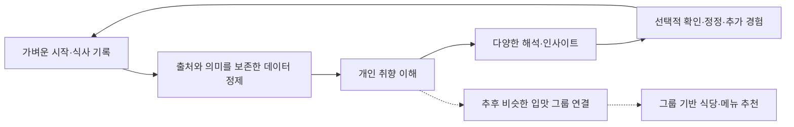
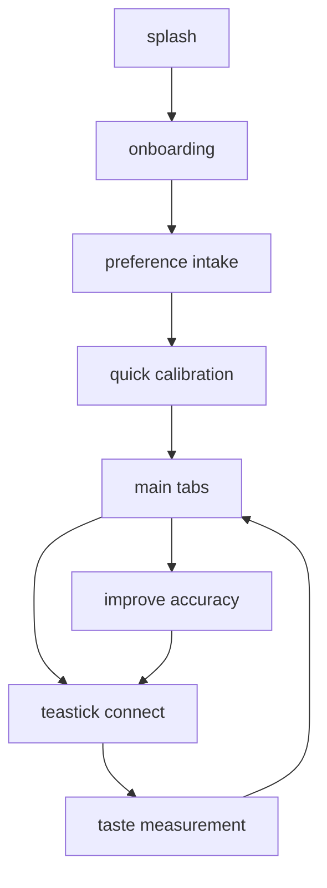
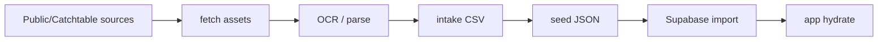

# Taste Buddy App Summary

작성일: 2026-04-24  
범위: 현재 저장소 기준의 서비스 설명, 구현 구조, 데이터, 로직, UX 요약

제품 목표 갱신: 2026-09-06. 아래 제품 정의·가치·핵심 루프는 최신 우선순위를 따른다. 개별 화면·데이터·구현 상태 표는 기존 구현 스냅샷이며 이번 목표 수정으로 전체 앱을 다시 검증하거나 변경한 것은 아니다.

이 문서는 Taste Buddy를 처음 보는 기획자, 디자이너, 엔지니어가 앱의 전체 구조를 빠르게 파악하기 위한 요약본이다. 세부 원칙의 source of truth는 아래 문서가 우선한다.

| 주제 | Source of truth |
| --- | --- |
| 제품 경험 | [`src/guidelines/TASTE_BUDDY_PRODUCT_EXPERIENCE_GUIDELINES.md`](../src/guidelines/TASTE_BUDDY_PRODUCT_EXPERIENCE_GUIDELINES.md) |
| 시각 시스템 | [`DESIGN.md`](../DESIGN.md) |
| AI용 디자인 시스템 요약 | [`docs/AI_DESIGN_SYSTEM.md`](./AI_DESIGN_SYSTEM.md) |
| 구조와 파일 배치 | [`ARCHITECTURE.md`](../ARCHITECTURE.md), [`CONTRIBUTING.md`](../CONTRIBUTING.md) |
| Supabase 구조 | [`supabase/README.md`](../supabase/README.md) |
| 콘텐츠 파이프라인 | [`scripts/README.md`](../scripts/README.md) |
| TasteBuddyAgent 상세 | [`docs/product/taste-buddy-agent.md`](./product/taste-buddy-agent.md) |

---

## 1. 한 줄 정의

Taste Buddy는 사용자의 취향을 이해하고, 식사 기록을 정제해 근거가 있는 다양한 해석과 인사이트를 제공하는 프리미엄 미식 서비스다.

제품 우선순위는 **개인 취향 이해·해석·인사이트 → 비슷한 입맛 그룹 연결 → 그룹의 추천·평가에 기반한 식당·메뉴 추천**이다. 추천이 없어도 개인의 취향을 이해하는 독립적인 가치를 제공해야 한다.

---

## 2. 제품 정체성

| 항목 | 내용 |
| --- | --- |
| 포지션 | 개인 취향 이해와 인사이트를 중심으로 한 프리미엄 미식 서비스 |
| 핵심 차별점 | 같은 정제 근거에서 감각·음식·조건·예외 등 다양한 관점의 해석 |
| 핵심 사용자 가치 | 내 취향을 이해하고, 기록에서 유용한 패턴·차이·미확정 지점을 발견 |
| 후속 확장 | 비슷한 입맛 그룹 연결, 이후 그룹 기반 식당·메뉴 추천 |
| 레스토랑/셰프 가치 | 손님의 미각 경향을 구조화해 의도한 경험이 더 잘 전달되도록 준비 |
| 하드웨어 위치 | 필수 진입점이 아니라 optional precision layer |
| 피해야 할 톤 | 의료 진단, 실험실 장비, generic booking app, 가벼운 퀴즈 앱 |

제품 언어는 "판정"보다 "해석", "완료"보다 "점진적 정교화", "명령"보다 "셰프 존중형 가이드"에 가깝다.

---

## 3. 핵심 서비스 루프

최신 제품 우선순위에 따른 핵심 루프는 다음과 같다. 원문·출처·감각·강도·호감·대상·시점·맥락을 보존해 정제하며, 출력 생성이 새 관찰이나 경험을 추가하지 않는다.



다음 표는 기존 구현에 존재하는 화면·데이터 연결의 참고 자료다. 예약·셰프 가이드를 포함하는 이 목록은 현재 제품 구축 우선순위를 의미하지 않는다.

| 기존 구현 단계 | 구현 표면 | 주요 데이터 |
| --- | --- | --- |
| Quick Taste Calibration | `QuickTasteCalibrationScreen` | 6개 맛 축 질문, slider response |
| Taste Profile Creation | calibration result, profile card, analysis | `TasteMeasurementSnapshot`, `RestaurantReadyGuidance` |
| Reservation Personalization | `DiningPage`, `ReservationCard`, `ReservationDetailSections` | 예약, 매칭률, chef guidance, timeline |
| Chef Calibration Guidance | reservation detail의 TCS/chef calibration section | taste axis, adjustment, recommendation logic |
| Dining Experience | 예약 상태/timeline으로 표현 | reservation status |
| Post-Dining Feedback | `DiningFeedbackFlow` | dish response, selected tags, overall rating |
| Profile Refinement | feedback analysis, learned deltas | `UserLearnedCalibration` |
| Optional Precision Calibration | `TeastickConnectScreen`, `TasteMeasurementScreen` | device-like measured snapshot |

---

## 4. 사용자와 사용 맥락

현재 제품은 파인다이닝 only보다 넓은 `high-consideration dining`을 전제로 잡는 것이 자연스럽다.

| 사용자 | 니즈 |
| --- | --- |
| 다이닝 입문자 | 비싼 식사에서 실패하고 싶지 않고, 내 취향에 맞을지 설명을 원함 |
| 반복 방문/기록형 사용자 | 왜 맞았는지, 왜 안 맞았는지 기록하고 다음 선택에 반영하고 싶음 |
| 레스토랑/셰프 | 사람마다 다른 짜다/싱겁다/무겁다의 해석 차이를 운영 가능한 언어로 받고 싶음 |

초기 커버리지는 파인다이닝, 오마카세, 호텔 다이닝, 일부 upscale casual까지 확장 가능하다. 단, UX 톤은 계속 calm, premium, precise를 유지해야 한다.

---

## 5. 기술 스택과 실행 구조

| 영역 | 현재 사용 |
| --- | --- |
| 프론트엔드 | React 18, Vite 6, TypeScript |
| 스타일 | Tailwind CSS 4, `src/styles/design-system.css`, `src/constants/designTokens.ts` |
| 컴포넌트 기반 | app-specific `system` components + generic Radix/shadcn-style `ui` primitives |
| 애니메이션 | Framer Motion |
| 차트 | Recharts, custom `HexRadarChart` |
| 아이콘 | `lucide-react` 중심 |
| 백엔드 | Supabase optional integration |
| 인증 | Supabase anonymous auth 가능 |
| 로컬 지속성 | `localStorage` 기반 user state fallback |

주요 실행 명령:

```bash
npm install
npm run dev
npm run build
```

주요 preview URL:

| 화면 | URL |
| --- | --- |
| 앱 | `http://127.0.0.1:3001` |
| 디자인 시스템 | `http://127.0.0.1:3001/design-system` |
| 디자인 시스템 업데이트 | `http://127.0.0.1:3001/design-system-updates` |
| Figma works preview | `http://127.0.0.1:3001/figma-works` |

---

## 6. 앱 상태와 화면 흐름

앱의 route composition과 state machine은 [`src/App.tsx`](../src/App.tsx)에 집중되어 있다.



초기 진입 판단:

| 조건 | 다음 화면 |
| --- | --- |
| 기존 측정 snapshot 있음 | main home |
| preference intake만 있음 | quick calibration |
| 아무 기록 없음 | onboarding |

메인 탭:

| 탭 | 파일 | 역할 |
| --- | --- | --- |
| Home | [`src/pages/HomePage.tsx`](../src/pages/HomePage.tsx) | 검색, 추천 셰프/식당, 현재 예약 요약 |
| Analysis | [`src/pages/AnalysisPage.tsx`](../src/pages/AnalysisPage.tsx) | 미각 프로필, 변화 추세, 해석 카드, 메뉴 추천 |
| Reservation | [`src/pages/DiningPage.tsx`](../src/pages/DiningPage.tsx) | 예약 목록, 개인화 설명, 셰프 보정, 식후 피드백 |
| Profile | [`src/pages/ProfilePage.tsx`](../src/pages/ProfilePage.tsx) | 미각 프로필, 통계, 선호 셰프, 설정/지원 진입 |

전역 overlay:

| 요소 | 파일 | 역할 |
| --- | --- | --- |
| Top app bar | [`src/components/TopAppBar.tsx`](../src/components/TopAppBar.tsx) | 측정 시작, 알림, 메뉴 |
| Bottom tab bar | [`src/components/BottomTabBar.tsx`](../src/components/BottomTabBar.tsx) | Home/Analysis/Reservation/Profile 이동 |
| Notification panel | [`src/components/NotificationPanel.tsx`](../src/components/NotificationPanel.tsx) | 예약, 피드백, 보정 알림 |
| App menu drawer | [`src/components/AppMenuDrawer.tsx`](../src/components/AppMenuDrawer.tsx) | 재측정, 정확도 개선, 도움말, 로그아웃 |

---

## 7. 주요 UX 표면

### 7.1 Onboarding

파일: [`src/pages/OnboardingScreen.tsx`](../src/pages/OnboardingScreen.tsx)

역할:

- Taste Buddy가 "더 잘 맞는 식사"를 만든다는 제품 가치를 설명한다.
- 영상/이미지 asset을 사용해 분석, 레스토랑 가이드, 학습 루프를 소개한다.
- `prefers-reduced-motion`이면 lightweight media를 우선한다.

### 7.2 Preference Intake

파일: [`src/pages/PreferenceIntakeScreen.tsx`](../src/pages/PreferenceIntakeScreen.tsx), [`src/constants/preferenceIntakeData.ts`](../src/constants/preferenceIntakeData.ts)

역할:

- 서비스 설명 다음의 사전 조사 화면.
- 한 화면에 한 질문과 선택 카드로 구성된다.
- 질문 범위는 알러지, 식이 제한, 선호 요리, 피하고 싶은 맛/질감, 풍미 강도, 탐험 성향, 레스토랑 공유 선호다.
- 결과는 `PreferenceIntakeProfile`로 저장되어 초기 추천과 레스토랑 전달 범위를 좁힌다.

### 7.3 Quick Taste Calibration

파일: [`src/pages/QuickTasteCalibrationScreen.tsx`](../src/pages/QuickTasteCalibrationScreen.tsx), [`src/constants/quickTasteCalibrationData.ts`](../src/constants/quickTasteCalibrationData.ts)

역할:

- 하드웨어 없이도 첫 taste profile을 만들기 위한 digital anchoring flow.
- 바나나맛우유, 피클, 아메리카노, 신라면, 평양냉면, 삼겹살처럼 익숙한 기준 음식으로 6개 맛 축을 보정한다.
- 결과는 `TasteMeasurementSnapshot`과 `RestaurantReadyGuidance`를 만든다.

### 7.4 Teastick / Measurement

파일: [`src/pages/TeastickConnectScreen.tsx`](../src/pages/TeastickConnectScreen.tsx), [`src/pages/TasteMeasurementScreen.tsx`](../src/pages/TasteMeasurementScreen.tsx)

역할:

- hardware precision layer의 mock/preview 성격.
- 체크리스트, 인트로, 준비, active measurement, finished 단계로 진행된다.
- active 단계는 시간 경과와 버튼 액션으로 측정값을 시뮬레이션한다.

### 7.5 Home

파일: [`src/pages/HomePage.tsx`](../src/pages/HomePage.tsx), [`src/components/home/HomeCards.tsx`](../src/components/home/HomeCards.tsx), [`src/components/home/HomeUnifiedSearch.tsx`](../src/components/home/HomeUnifiedSearch.tsx)

역할:

- 현재 프로필 기반 요약, 최근 변화, 측정 refresh CTA, Taste Match Feed를 보여준다.
- `TasteBuddyAgent`가 viewer taste identity와 공개 리뷰 그래프를 비교해 유사 미각/대비 미각 기반 추천 이유를 만든다.
- Supabase가 있으면 restaurant content catalog, user learned calibration, social taste graph를 hydrate한다.
- Supabase가 없으면 local fallback catalog와 deterministic fallback social graph로 앱이 동작한다.

### 7.6 Saved Restaurants

파일: [`src/pages/SavedRestaurantListPage.tsx`](../src/pages/SavedRestaurantListPage.tsx), [`src/components/restaurant/RestaurantBookmarkSheet.tsx`](../src/components/restaurant/RestaurantBookmarkSheet.tsx)

역할:

- 식당 상세에서 saved restaurant를 리스트에 넣고, 저장 화면에서 리스트/카테고리별로 다시 비교한다.
- 리스트는 "가보고 싶은 다이닝", "셰프 관심 리스트"처럼 다음 다이닝 판단을 돕는 언어를 쓴다.
- 로컬 저장을 기본 fallback으로 유지하고, 로그인 이메일이 있으면 Supabase의 `restaurant_bookmark_lists`, `restaurant_bookmarks`와 병합/동기화한다.

### 7.7 Analysis

파일: [`src/pages/AnalysisPage.tsx`](../src/pages/AnalysisPage.tsx)

역할:

- 미각 축별 측정값, 기준 평균 대비 delta, 변화 추세, profile confidence를 해석한다.
- raw number보다 "무슨 의미인지"와 "다음 예약에 어떻게 쓰이는지"를 앞세운다.
- `Recharts`와 `HexRadarChart`를 함께 사용한다.

### 7.8 Reservation

파일: [`src/pages/DiningPage.tsx`](../src/pages/DiningPage.tsx), [`src/components/reservation/ReservationDetailSections.tsx`](../src/components/reservation/ReservationDetailSections.tsx)

역할:

- 예약 목록과 예약 상세를 제공한다.
- 상세에서는 personalization hero, chef summary, dining interpretation, timeline, chef calibration guidance를 보여준다.
- 완료 예약에서는 식후 피드백과 AI analysis flow로 이어진다.

### 7.9 Dining Feedback

파일: [`src/components/reservation/DiningFeedbackFlow.tsx`](../src/components/reservation/DiningFeedbackFlow.tsx), [`src/constants/diningFeedbackData.ts`](../src/constants/diningFeedbackData.ts)

역할:

- 식후 회고를 "다음 식사를 더 잘 맞추는 투자"처럼 만든다.
- 메뉴 선택/직접 추가, dish kind, dish별 선택지, 디테일 태그, 만족도, return intent, overall comment를 받는다.
- 회고 노트와 사진은 private learning artifact로 다루며, 사진은 R2 object key를 `feedback_items.reflection_photo_preview_url`에 저장한다.
- 선택지는 taste/perceptual delta로 파싱되어 learned calibration에 반영된다.

### 7.10 Profile

파일: [`src/pages/ProfilePage.tsx`](../src/pages/ProfilePage.tsx)

역할:

- 현재 미각 profile, 측정 freshness, 사용 통계, 선호 셰프, 설정/도움말 진입점을 보여준다.
- profile은 completed/incomplete가 아니라 Starter/Building/Refined처럼 evolving confidence로 읽힌다.

---

## 8. 데이터 모델 요약

### 8.1 로컬 앱 상태

파일: [`src/App.tsx`](../src/App.tsx)

localStorage key:

```text
tastebuddy-user-state-v5
```

저장 항목:

| 필드 | 의미 |
| --- | --- |
| `hasCompletedInitialMeasurement` | 초기 측정 완료 여부 |
| `latestPreferenceIntakeProfile` | 사전 조사 응답 profile |
| `latestRestaurantReadyGuidance` | 예약/셰프 전달용 starter guidance |
| `latestTasteMeasurementSnapshot` | 최신 미각 측정 snapshot |

구버전 key `v1`부터 `v4`까지 migrate/fallback으로 읽고 제거한다.

### 8.2 앱 내 fallback constants

| 파일 | 역할 |
| --- | --- |
| [`src/constants/tasteMeasurementData.ts`](../src/constants/tasteMeasurementData.ts) | 6개 taste axis 측정값, 평균값, delta, stale 판단 |
| [`src/constants/quickTasteCalibrationData.ts`](../src/constants/quickTasteCalibrationData.ts) | digital anchoring 질문과 starter guidance 생성 |
| [`src/constants/preferenceIntakeData.ts`](../src/constants/preferenceIntakeData.ts) | 사전 조사 질문/선택지/profile builder |
| [`src/constants/reservationCatalog.ts`](../src/constants/reservationCatalog.ts) | mock/fallback reservation catalog |
| [`src/constants/diningFeedbackData.ts`](../src/constants/diningFeedbackData.ts) | 식후 feedback scenario, dish metadata, feedback choice |
| [`src/constants/dishKindTags.ts`](../src/constants/dishKindTags.ts) | dish kind option, custom dish kind, 메뉴 메타데이터 기반 kind inference |
| [`src/constants/tastePersonalization.ts`](../src/constants/tastePersonalization.ts) | dish signal weight, research rules, feedback tag definitions |
| [`src/constants/tasteColors.ts`](../src/constants/tasteColors.ts) | taste color helper |
| [`src/constants/designTokens.ts`](../src/constants/designTokens.ts) | typed design token mirror |

### 8.3 Supabase 설정

파일: [`src/lib/supabase.ts`](../src/lib/supabase.ts)

환경 변수:

```text
VITE_SUPABASE_URL
VITE_SUPABASE_PUBLISHABLE_KEY
VITE_SUPABASE_ANON_KEY
VITE_SUPABASE_USE_ANONYMOUS_AUTH
```

동작 방식:

- URL과 public key가 있으면 Supabase client를 만든다.
- 세션이 없고 anonymous auth가 비활성화되지 않았다면 `signInAnonymously()`를 호출한다.
- Supabase가 없거나 실패하면 주요 화면은 fallback data로 동작한다.

### 8.4 Supabase schema

주요 migration: [`supabase/migrations/20260326_taste_buddy_mvp.sql`](../supabase/migrations/20260326_taste_buddy_mvp.sql)

| 그룹 | 테이블 | 역할 |
| --- | --- | --- |
| 사용자 | `profiles` | Supabase auth user의 app profile |
| 하드웨어 | `devices` | Teastick 같은 device 상태 |
| 측정 | `measurement_sessions`, `measurement_results` | quick calibration/teastick/manual 측정 기록과 6개 taste result |
| 레스토랑 | `restaurants`, `chefs` | 식당과 셰프 master data |
| 콘텐츠 | `source_documents`, `dish_entities`, `dish_observed_facts`, `dish_inference_profiles`, `research_rules` | 메뉴/리뷰/공개 자료에서 만든 dish inference data |
| 예약 | `reservations`, `reservation_dishes`, `tcs_guidance_packets` | 예약, 코스 dish, chef-facing guidance packet |
| 피드백 | `feedback_submissions`, `feedback_items`, `feedback_parses` | 식후 피드백, dish kind/detail tag, 회고 노트/사진, taste/perceptual parse |
| 학습 | `user_learned_deltas` | 사용자별 learned calibration delta |
| 알림 | `notifications` | 예약/측정/피드백 notification |
| 소셜 미각 그래프 | `taste_social_profiles`, `taste_dining_reviews` | 공개 가능한 taste identity와 dining review 기반 Taste Match Feed |
| 저장한 레스토랑 | `restaurant_bookmark_lists`, `restaurant_bookmarks` | 이메일 기준 bookmark list와 saved restaurant 동기화 |

보안:

- 대부분 user-owned table은 RLS로 `auth.uid()` 기준 own row만 select/insert/update 가능하다.
- `restaurants`, `chefs`, `dish_entities`, `dish_inference_profiles`, `research_rules` 등 public content table은 [`20260330_public_content_reads.sql`](../supabase/migrations/20260330_public_content_reads.sql)에서 anon/authenticated read policy가 추가되어 있다.
- `taste_social_profiles`, `taste_dining_reviews`는 공개/팔로워 공개 범위만 읽히도록 RLS를 두고, seed profile은 `is_seed`와 `seed_source`로 구분한다.
- `restaurant_bookmark_lists`, `restaurant_bookmarks`는 `auth.jwt()->>'email'`의 lowercase 값과 `owner_email`을 맞춰 이메일 로그인 사용자의 리스트를 동기화한다.
- `search_profiles_by_identity()`는 display name과 nickname을 함께 검색하고, 기존 `search_profiles_by_nickname()`는 compatibility wrapper로 유지한다.

### 8.5 Supabase read/write 함수

파일: [`src/lib/tasteBuddySupabase.ts`](../src/lib/tasteBuddySupabase.ts)

| 함수 | 역할 |
| --- | --- |
| `hydrateReservationPageData()` | 예약, feedback draft, feedback scenario hydrate |
| `hydrateLatestMeasurementSnapshot()` | 최신 completed measurement hydrate |
| `hydrateRecentMeasurementSnapshots()` | analysis trend용 최근 측정 목록 hydrate |
| `hydrateUserLearnedCalibration()` | user learned deltas hydrate |
| `hydrateRestaurantContentCatalog()` | chef/dish content catalog hydrate |
| `persistTasteMeasurementSnapshot()` | 측정 session/result 저장 |
| `submitDiningFeedbackToSupabase()` | feedback submission/item/parse 저장 및 learned deltas 업데이트 |

추가 Supabase adapter:

| 파일 | 역할 |
| --- | --- |
| [`src/lib/tasteBuddyAgentSupabase.ts`](../src/lib/tasteBuddyAgentSupabase.ts) | `taste_social_profiles`, `taste_dining_reviews`를 TBA public profile/review graph로 hydrate |
| [`src/lib/restaurantBookmarksSupabase.ts`](../src/lib/restaurantBookmarksSupabase.ts) | 이메일 기준 bookmark list와 saved restaurant 상태 hydrate/persist |

---

## 9. 콘텐츠/데이터 파이프라인

Taste Buddy 저장소는 앱 코드뿐 아니라 restaurant/menu content pipeline도 포함한다.

| 위치 | 역할 |
| --- | --- |
| [`docs/content/intake/`](./content/intake/) | MVP restaurant/menu intake CSV |
| [`docs/content/planning/`](./content/planning/) | content data plan, restaurant shortlist, worklist |
| [`scripts/`](../scripts/) | fetch, OCR, parse, seed generation, Supabase import |
| [`supabase/seeds/`](../supabase/seeds/) | import 가능한 restaurant/menu seed JSON |

대표 pipeline:



관련 npm scripts:

| 명령 | 역할 |
| --- | --- |
| `catchtable:fetch` | Catchtable menu asset fetch |
| `catchtable:ocr` | menu image OCR |
| `catchtable:parse` | OCR output parse |
| `catchtable:generate-csv` | intake CSV 생성 |
| `catchtable:generate-seed` | Supabase seed JSON 생성 |
| `catchtable:sync-review` | review 결과 Supabase sync |
| `public-source:fetch` | 공개 restaurant source fetch |
| `intake:generate-seed` | intake CSV 기반 seed 생성 |
| `seed:supabase` | Supabase seed import |

---

## 10. 핵심 로직 요약

### 10.1 Taste axis

Taste Buddy의 현재 기본 taste axis는 6개다.

| id | label |
| --- | --- |
| `sweet` | 단맛 |
| `sour` | 신맛 |
| `bitter` | 쓴맛 |
| `salty` | 짠맛 |
| `umami` | 감칠맛 |
| `fat` | 지방맛 |

측정값은 `value_mm` 성격의 0-10 구간 숫자로 표현되고, 평균 기준값과 비교해 `deltaMm`를 만든다. UX에서는 숫자를 직접 앞세우기보다 "더 또렷하게 감지", "더 부드럽게 필요" 같은 해석을 먼저 보여준다.

### 10.2 Quick calibration scoring

파일: [`src/constants/quickTasteCalibrationData.ts`](../src/constants/quickTasteCalibrationData.ts)

흐름:

1. 사용자가 각 taste anchor에 대해 `-3`부터 `3`까지 선택한다.
2. 상대값은 0-100 absolute score로 변환된다.
3. absolute score는 0-10 measurement value로 변환된다.
4. 6개 축 vector로 `TasteMeasurementSnapshot`을 만든다.
5. snapshot에서 `RestaurantReadyGuidance`를 만든다.

생성되는 guidance:

| 필드 | 의미 |
| --- | --- |
| `topAxes`, `topLabels` | 현재 더 살아나는 taste 축 |
| `cautionAxis`, `cautionLabel` | 과하게 밀지 않거나 주의할 축 |
| `summaryLine` | 예약/셰프가 읽기 쉬운 한 줄 해석 |
| `evidence` | 근거 문장 |
| `confidence` | Starter / Building / Refined |
| `goalPhrase` | 첫 추천 방향 |

### 10.3 Measurement freshness

파일: [`src/constants/tasteMeasurementData.ts`](../src/constants/tasteMeasurementData.ts)

규칙:

- 측정 stale 기준은 30일이다.
- `getTasteMeasurementAgeLabel()`은 "오늘 측정", "어제 측정", "N일 전 측정"으로 표시한다.
- stale이면 Home/Reservation/Profile에서 재측정 CTA가 뜬다.

### 10.4 Reservation personalization

파일: [`src/pages/DiningPage.tsx`](../src/pages/DiningPage.tsx)

핵심 함수:

```text
buildReservationPersonalizationSummary()
```

동작:

- 최신 measurement snapshot에서 가장 강한 taste axis 2개와 가장 부드러운 축을 찾는다.
- reservation의 `adjustments`와 결합해 chef guidance 문장을 만든다.
- `headline`, `guestMessage`, `nextStepCta`, `recommendationLogic`을 만든다.
- 이 결과가 personalization hero, chef calibration section, pending action card에 들어간다.

### 10.5 Chef / dish matching

파일: [`src/lib/chefMatching.ts`](../src/lib/chefMatching.ts)

동작:

- 사용자 snapshot을 0-1 taste vector로 변환한다.
- Supabase dish inference profile의 taste/perceptual vector와 비교한다.
- learned calibration이 있으면 `projectDishForUser()`로 dish profile을 사용자 기준으로 보정한다.
- score는 `tasteAlignment`, `dominantTasteFit`, `confidence`를 조합한다.
- match rate는 floor 55 + raw score range 42로 계산된다.
- confidence label은 `starter`, `building`, `strong` 중 하나다.

### 10.6 Feedback learning

파일: [`src/lib/tastePersonalization.ts`](../src/lib/tastePersonalization.ts), [`src/lib/tasteBuddySupabase.ts`](../src/lib/tasteBuddySupabase.ts)

흐름:

1. 사용자가 dish별 feedback choice를 고른다.
2. choice id가 `DEFAULT_FEEDBACK_TAG_DEFINITIONS`와 매칭된다.
3. tag는 perception taste delta, perception perceptual delta, preference taste delta, preference perceptual delta를 가진다.
4. rating, recency, source confidence, parsed confidence로 learning weight를 계산한다.
5. reservation 단위 learning signal을 만든다.
6. `user_learned_deltas`에 누적 보정값을 upsert한다.

핵심 감각:

- 피드백은 단순 별점 평균이 아니라 "무엇을 어떻게 다르게 느꼈는지"를 다음 추천과 chef guidance에 반영하는 데이터다.
- confidence가 낮은 신호는 hypothesis count로 쌓이고, 충분한 support가 생기면 profile refinement에 더 강하게 반영된다.

### 10.7 TasteBuddyAgent social matching

파일: [`src/lib/tasteBuddyAgent.ts`](../src/lib/tasteBuddyAgent.ts), [`src/lib/tasteBuddyAgentSupabase.ts`](../src/lib/tasteBuddyAgentSupabase.ts), [`src/types/tasteBuddyAgent.ts`](../src/types/tasteBuddyAgent.ts)

동작:

1. 6축 측정값, 피드백 수, 리뷰 수를 `TasteProfileSnapshot`으로 해석한다.
2. 공개 가능한 `PublicTasteProfile`은 raw measurement 대신 taste signature, stage, 공개 통계만 노출한다.
3. 공개 dining review는 rating, dish kind, taste tag, experience/detail tag, review snippet을 taste evidence로 변환한다.
4. viewer와 reviewer의 taste/perceptual vector를 비교해 `TasteSimilarityEdge`를 만든다.
5. 유사도, 리뷰 신뢰도, 최근성, 다양성을 합쳐 `TasteMatchFeedItem`을 생성한다.

핵심 감각:

- social feed는 친구 수 경쟁이 아니라 "내 입맛 기준에서 이 기록을 왜 참고할 수 있는가"를 설명해야 한다.
- profile 공개는 opt-in이어야 하며, raw taste data보다 해석 가능한 identity와 공개 리뷰만 앞세운다.

---

## 11. UX / 디자인 시스템 요약

Taste Buddy의 시각 방향은 `Quiet Hospitality Intelligence`다.

| 원칙 | 현재 구현 |
| --- | --- |
| 모바일 우선 | `100dvh`, 20px gutter, top/bottom app shell |
| 밝고 정돈된 surface | page bg `#F3F3F3`, white cards |
| 작은 타이포 위계 | 제품 UI 텍스트 ceiling `18px` |
| Pretendard 단일 폰트 | global/system token 기준 |
| taste color는 의미용 | `TasteChip`, `TasteTintCard`, radar/chart, taste-specific cards |
| interpretation first | profile, reservation, feedback analysis에서 raw data보다 해석 우선 |
| chef-respectful framing | "명령"보다 "참고", "전달", "조율" 언어 사용 |

주요 system components:

| 컴포넌트 | 역할 |
| --- | --- |
| `SectionCard` | 흰 카드 shell |
| `PrimaryButton` | 주요 CTA |
| `StatusChip`, `TasteChip`, `Chip` | 상태/맛/메타 label |
| `PageSection`, `SectionTitle` | screen grouping |
| `FlowHeaderBlock`, `FlowStepCta`, `FlowBottomCta` | onboarding/calibration flow 구조 |
| `SelectionCard` | 한 질문 한 선택 카드 패턴 |
| `HexRadarChart` | taste profile 시각화 |
| `ProfileConfidenceCard` | Starter/Building/Refined confidence |
| `InterpretationCard`, `InterpretationDetailDrawer` | 해석 카드와 상세 설명 |
| `TCSHintCard`, `TCSBadge` | chef calibration / TCS 관련 신호 |

---

## 12. 구현 레이어 맵

| 레이어 | 경로 | 현재 역할 |
| --- | --- | --- |
| App entry | [`src/main.tsx`](../src/main.tsx), [`src/App.tsx`](../src/App.tsx) | React bootstrap, app state machine, internal preview routing |
| Route pages | [`src/pages/`](../src/pages/) | 주요 화면과 flow |
| Product components | [`src/components/system/`](../src/components/system/) | Taste Buddy 고유 UI building block |
| Feature components | [`src/components/home/`](../src/components/home/), [`src/components/reservation/`](../src/components/reservation/), [`src/components/measurement/`](../src/components/measurement/) | 화면/도메인 전용 조합 |
| Generic UI | [`src/components/ui/`](../src/components/ui/) | Radix/shadcn-style primitive |
| Constants | [`src/constants/`](../src/constants/) | fallback data, product rules, token mirror |
| Logic | [`src/lib/`](../src/lib/) | Supabase, matching, personalization, runtime token override |
| Types | [`src/types/`](../src/types/) | taste personalization type |
| Styles | [`src/styles/`](../src/styles/) | design-system CSS, generic globals |
| Assets | [`src/assets/`](../src/assets/) | 이미지, 영상, 로고 |
| Backend artifacts | [`supabase/`](../supabase/) | migrations, seeds |
| Data pipeline | [`scripts/`](../scripts/) | content fetch/OCR/parse/seed/import |

---

## 13. 현재 구현도

| 영역 | 구현도 | 메모 |
| --- | --- | --- |
| 앱 shell / 탭 구조 | 구현됨 | splash, onboarding, calibration, main tabs, overlay 포함 |
| 온보딩 | 구현됨 | 영상/이미지 기반 제품 설명 |
| 사전 조사 | 구현됨 | 한 화면 한 질문, `PreferenceIntakeProfile` 생성 |
| Quick calibration | 구현됨 | digital anchoring으로 starter profile 생성 |
| Teastick measurement | 프로토타입 | 실제 hardware integration보다 UI/시뮬레이션 중심 |
| Home personalization | 구현 방향 전환 | 예약/셰프 준비보다 Taste Match Feed 중심의 social taste discovery로 전환 |
| TasteBuddyAgent (TBA) Social | MVP 구현 | taste identity, public profile, dining review, similarity edge, match feed deterministic engine |
| Analysis | 구현됨 | profile, trend, interpretation, menu recommendation surface |
| Reservation personalization | 구현됨 | 예약 상세, chef calibration guidance, timeline |
| Post-dining feedback | 구현됨 | feedback 저장, parsed deltas, analysis summary |
| Feedback learning | 부분 구현 | heuristic/tag 기반 learned deltas upsert |
| Supabase backend | MVP 구현 | schema, RLS, hydrate/persist 함수 있음 |
| Restaurant content pipeline | MVP 구현 | fetch/OCR/parse/intake/seed/import workflow |
| Chef dashboard | 미구현 | 현재는 guest app 안의 chef guidance 표현 중심 |
| 실제 예약 provider 연동 | 미구현 | external handoff/reference 수준 |
| Public taste profile / Matches | MVP 구현 | opt-in 공개 전제의 public taste profile, similar palate, match feed surface 구현 |
| 자동 chef correction workflow | Phase 2 | 현재는 taste brief/guidance framing 수준 |

---

## 14. 현재 앱이 말하는 핵심 약속

사용자에게:

- "내 입맛을 판단하는 게 아니라 이해해 간다."
- "첫 프로필은 빠르게 만들고, 식사와 피드백을 통해 더 정교해진다."
- "같은 기록에서 내 취향의 패턴, 조건별 차이, 예외를 여러 관점으로 이해할 수 있다."
- "이후 비슷한 입맛 그룹과 무엇이 닮았고 다른지 연결해 준다."
- "그룹의 추천과 평가를 근거로 식당과 메뉴 탐색을 확장한다."

셰프/레스토랑에게:

- "손님이 무엇을 더 강하게 혹은 더 부드럽게 느낄 수 있는지 구조화한다."
- "셰프의 의도를 바꾸라는 것이 아니라, 전달이 더 잘 되도록 참고 신호를 제공한다."
- "리뷰 평균보다 individual dining experience와 taste interpretation을 더 중요하게 본다."

---

## 15. 지금 가장 중요한 다음 과제

| 과제 | 이유 |
| --- | --- |
| Taste Match Feed 실제 데이터화 | 현재 fallback public profiles/reviews를 Supabase 공개 리뷰 그래프로 연결해야 함 |
| Dining Review 작성 경험 재정의 | 피드백을 private learning과 public review로 자연스럽게 분리해야 함 |
| Public profile opt-in UX | raw data를 숨기면서도 taste identity 공개 범위를 명확히 해야 함 |
| Similar palate 설명 고도화 | 친구 수보다 "왜 이 사람의 기록을 믿을 수 있는지"가 중요 |
| Chef-facing brief 재검토 | v1 social taste network에서는 우선순위가 낮아졌으므로 별도 phase로 격리 |
| 실제 예약 provider handoff 정리 | 앱이 booking app처럼 보이지 않으면서도 행동으로 이어져야 함 |
| Supabase seed와 UI fallback 간 정합성 점검 | MVP demo와 실제 data hydration 차이를 줄이기 위함 |

---

## 16. 한 문장으로 다시 정리

Taste Buddy는 고가의 다이닝 선택에서 사용자가 느끼는 불확실성을 "내 미각 기준으로 왜 맞는지"라는 설명으로 줄이고, 식후 기록을 다시 학습해 다음 예약과 셰프 준비에 반영하는 taste intelligence 서비스다.
