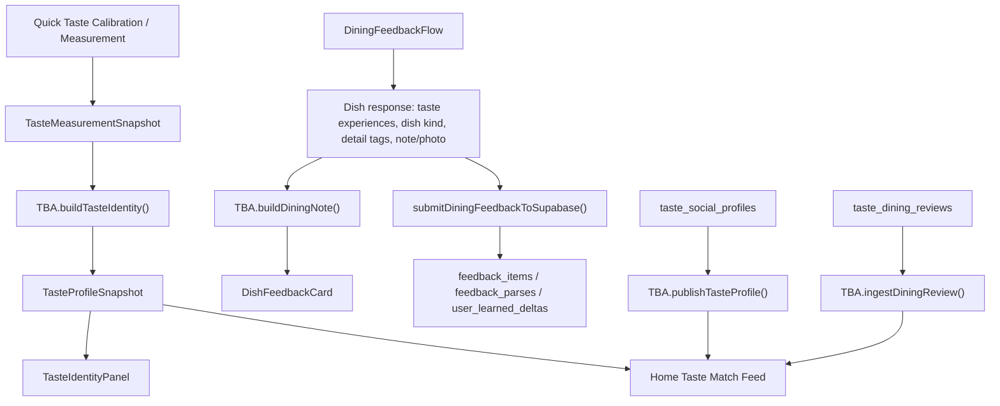

# TasteBuddyAgent (TBA) Product and System Guide

작성일: 2026-05-29  
범위: TasteBuddyAgent의 제품 역할, 데이터 구조, 설문/피드백 입력, 미각 버블, 디테일 태그, 소셜 매치 피드 작동 방식

제품 목표 갱신: 2026-09-06. 아래 함수·점수·기존 화면 설명은 기존 구현 참고 자료다. 장기 플랫폼의 목표와 신규 데이터 계약은 [플랫폼 아키텍처](./tba-data-platform-architecture.md)와 [분석·해석 모델](./tba-analysis-interpretation-model.md)을 따른다.

TasteBuddyAgent, 줄여서 TBA의 최우선 목적은 사용자의 취향을 이해하고 다양한 해석과 인사이트로 제공하는 것이다. 원문과 출처를 보존해 정제한 근거를 경험 요약·감각 프로필·조건 차이·예외·미확정 정보 등에 재사용한다. 이후 비슷한 입맛 그룹을 연결하고, 그 그룹의 추천·평가를 근거로 식당·메뉴 추천을 추가한다.

기존 구현은 측정값, 식후 피드백, 공개 리뷰, 태그, confidence를 정해진 규칙으로 조합해 홈 피드, 프로필, 디시 카드, 다이닝 노트를 만드는 deterministic agent layer다. 이 구현 설명은 새로운 제품 우선순위나 정제 계약이 앱에 모두 반영됐다는 뜻이 아니다.

---

## 1. Core Position

| 항목 | 설명 |
| --- | --- |
| 제품 역할 | 개인 취향 이해와 다양한 해석·인사이트를 먼저 제공하고, 이후 그룹 연결과 그룹 기반 추천으로 확장 |
| 구현 성격 | deterministic TypeScript logic, Supabase optional hydration, local fallback 가능 |
| 핵심 가치 | raw measurement보다 해석 가능한 taste signal을 먼저 보여준다 |
| 사용자 경험 | 내 취향의 의미·조건·예외를 이해하고, 기록을 통해 새로운 관점의 인사이트를 얻는다 |
| 소셜 원칙 | follower/status 경쟁이 아니라 "참고 가능한 미각 유사성"을 설명한다 |

TBA가 생성하는 주요 결과:

- `TasteProfileSnapshot`: 개인 미각 정체성
- `PublicTasteProfile`: 공개 가능한 미각 프로필
- `DiningReview`: 공개/비공개 다이닝 리뷰 evidence
- `TasteSimilarityEdge`: 두 프로필 사이의 유사성 설명
- `TasteMatchFeedItem`: 홈 피드에 노출되는 추천 단위
- `TasteBuddyAgentDiningNote`: 디시 카드용 요약, 미각 버블, 디테일 태그

---

## 2. Implementation Map

| 파일 | 역할 |
| --- | --- |
| [`src/lib/tasteBuddyAgent.ts`](../../src/lib/tasteBuddyAgent.ts) | TBA core logic. identity, profile publish, review ingest, similarity, feed, dining note 생성 |
| [`src/types/tasteBuddyAgent.ts`](../../src/types/tasteBuddyAgent.ts) | TBA domain types |
| [`src/types/tasteBuddyKnowledge.ts`](../../src/types/tasteBuddyKnowledge.ts) | TBA food knowledge RAG, Core Taste Lexicon, KnowledgeDoc types |
| [`src/constants/tbaCoreTasteLexicon.ts`](../../src/constants/tbaCoreTasteLexicon.ts) | 100개 Core Taste Lexicon candidate. taste/perceptual vector와 confidence gate metadata |
| [`src/lib/tasteBuddyAgentSupabase.ts`](../../src/lib/tasteBuddyAgentSupabase.ts) | Supabase social graph rows를 TBA profile/review로 hydrate |
| [`src/components/social/TasteMatchFeed.tsx`](../../src/components/social/TasteMatchFeed.tsx) | Home social discovery UI. buddy/restaurant/chef recommendation sections |
| [`src/components/social/SocialDishFeedbackCard.tsx`](../../src/components/social/SocialDishFeedbackCard.tsx) | `TasteMatchFeedItem`을 디시 카드 view model로 변환 |
| [`src/components/dining/DishFeedbackCard.tsx`](../../src/components/dining/DishFeedbackCard.tsx) | 소셜/개인 디시 피드백 카드 UI |
| [`src/components/profile/TasteIdentityPanel.tsx`](../../src/components/profile/TasteIdentityPanel.tsx) | taste identity, stable patterns, watch points, similar profiles 표시 |
| [`src/components/reservation/DiningFeedbackFlow.tsx`](../../src/components/reservation/DiningFeedbackFlow.tsx) | 식후 피드백 설문, 미각 버블, 디테일 태그 입력 |
| [`src/constants/dishKindTags.ts`](../../src/constants/dishKindTags.ts) | dish kind option, custom kind, keyword inference |
| [`src/constants/diningFeedbackData.ts`](../../src/constants/diningFeedbackData.ts) | feedback draft/scenario/dish metadata |
| [`supabase/migrations/20260527_taste_agent_social_seed.sql`](../../supabase/migrations/20260527_taste_agent_social_seed.sql) | `taste_social_profiles`, `taste_dining_reviews` schema/RLS/seed |
| [`supabase/migrations/20260527_taste_agent_social_dev_enrichment.sql`](../../supabase/migrations/20260527_taste_agent_social_dev_enrichment.sql) | richer dev social profiles/reviews |

Food knowledge RAG와 Core Taste Lexicon 확장 계획은 [`docs/product/tba-knowledge-rag-plan.md`](./tba-knowledge-rag-plan.md)를 기준으로 한다.

---

## 3. End-to-End Flow



TBA는 세 개의 루프를 연결한다.

| 루프 | 입력 | TBA 처리 | 출력 |
| --- | --- | --- | --- |
| Identity loop | 6축 측정값, 피드백 수, 리뷰 수 | taste/perceptual/preference/sensitivity vector 생성 | taste signature, stage, stable pattern, watch point |
| Social discovery loop | 공개 프로필, 공개 리뷰 | 유사도, item fit, freshness, confidence 계산 | Taste Match Feed |
| Dining feedback loop | 식후 미각 버블, 디테일 태그, dish kind, 리뷰 문장 | 디시 카드용 미식 노트와 태그 생성 | synthesis summary, taste bubbles, detail tags |

---

## 4. Core Data Structures

### 4.1 TasteProfileSnapshot

`TasteProfileSnapshot`은 TBA의 내부 기준 프로필이다.

| 필드 | 의미 |
| --- | --- |
| `tasteVector` | 6축 미각 측정값을 0-1로 정규화한 vector |
| `perceptualVector` | 밝음, 여운, 무게감, 질감 등 경험적 축 |
| `preferenceVector` | 사용자가 다음 추천에서 편하게 받아들일 가능성이 높은 축 |
| `sensitivityVector` | 특정 맛이 강해졌을 때 피로하거나 민감해질 수 있는 정도 |
| `confidenceByAxis` | 축별 evidence confidence |
| `stablePatterns` | 안정적으로 읽히는 taste/perceptual 신호 |
| `watchPoints` | 더 확인해야 할 민감도/낮은 confidence 축 |
| `stage` | `Starter`, `Learning`, `Patterned`, `Refined` |
| `tasteSignature` | 사용자에게 보이는 한 줄 미각 정체성 |

### 4.2 PublicTasteProfile

공개 프로필은 raw data dashboard가 아니라 소셜 탐색에 필요한 최소 identity다.

| 필드 | 의미 |
| --- | --- |
| `displayName`, `nickname`, `avatarPath` | 공개 표시 정보 |
| `visibility` | `private`, `followers`, `public` |
| `stage`, `tasteSignature` | 공개 가능한 해석 |
| `publicStats.reviewCount`, `averageRating` | 공개 리뷰 기반 신뢰 단서 |
| `snapshot` | 현재 구현에서는 매치 계산에 쓰는 profile snapshot |

주의: 제품 원칙상 공개 프로필은 opt-in이어야 하고, raw measurement보다 taste identity가 먼저 읽혀야 한다.

### 4.3 DiningReview

`DiningReview`는 공개/비공개 다이닝 경험을 TBA가 이해할 수 있는 evidence로 바꾼 구조다.

| 필드 | 의미 |
| --- | --- |
| `restaurantId`, `restaurantName` | 식당 기준 |
| `dishId`, `dishTitle` | 디시 기준. 없으면 식당 리뷰로 취급 |
| `rating` | 1-5 정수 |
| `reviewSnippet` | 카드/노트에 쓸 짧은 문장 |
| `tasteTags` | `fresh`, `savory`, `crisp` 같은 미각 신호 태그 |
| `experienceTags` | `delicate`, `rich`, `smoky` 같은 경험 신호 태그 |
| `dishKindTags` | 해산물, 육류, 디저트 등 dish kind |
| `tasteSignals` | tag를 6축 taste vector로 변환한 결과 |
| `visibility` | feed 포함 여부를 결정 |

---

## 5. Taste Identity Mechanism

### 5.1 Measurement Normalization

`TasteMeasurementSnapshot.results`는 0-10 구간 값을 갖는다. TBA는 이를 0-1로 정규화한다.

```text
tasteVector[tasteId] = clamp(measurementValue / 10)
```

값이 없으면 중립값 `0.5`로 취급한다. 이 덕분에 cold start에서도 앱이 작동한다.

### 5.2 Perceptual Vector

TBA는 6축 taste vector를 사용자 경험 언어로 번역하기 위해 perceptual vector를 만든다.

| Perceptual axis | 해석 | 주요 재료 |
| --- | --- | --- |
| `brightness` | 밝은 산뜻함 | 신맛, 쓴맛, 낮은 지방감 |
| `heaviness` | 무게감 | 지방맛, 감칠맛, 짠맛 |
| `cleanFinish` | 깔끔한 마무리 | 낮은 지방감, 신맛, 낮은 감칠맛 |
| `linger` | 긴 여운 | 감칠맛, 쓴맛, 지방맛 |
| `smoke` | 스모키함 | 쓴맛, 감칠맛, 지방맛 |
| `aromaIntensity` | 향의 선명도 | 신맛, 쓴맛, 감칠맛, 단맛 |
| `textureRichness` | 질감의 밀도 | 지방맛, 감칠맛, 단맛 |
| `thermalImpact` | 온도감/자극감 | 쓴맛, 신맛, 짠맛, 감칠맛 |

이 축들은 의료적 민감도가 아니라 다이닝에서 느끼는 경험적 언어다.

### 5.3 Sensitivity and Preference

Sensitivity는 중심값 `0.5`에서 얼마나 멀리 떨어져 있는지, 그리고 높은 값이 얼마나 강한지를 본다.

```text
sensitivity = 0.32 + abs(value - 0.5) * 0.95 + max(0, value - 0.72) * 0.25
```

Preference는 해당 맛을 좋아할 가능성과 피로도를 함께 본다.

```text
preference = 0.26 + value * 0.68 - sensitivity * 0.08
```

즉 "강하게 느낀다"와 "무조건 더 원한다"를 분리한다.

### 5.4 Confidence and Stage

축별 confidence는 측정값 유무, 측정 source, 피드백/리뷰 evidence, 축의 salience를 조합한다.

| 요소 | 영향 |
| --- | --- |
| 값 존재 | 값이 있으면 base confidence가 높아진다 |
| measured source | 실제/측정 기반이면 추가 confidence |
| feedback + review count | 최대 0.22까지 evidence lift |
| 중심에서 벗어난 정도 | 더 두드러진 taste axis는 salience lift |

Stage 기준:

| Stage | 조건 |
| --- | --- |
| `Starter` | evidence가 거의 없거나 confidence가 낮음 |
| `Learning` | 평균 confidence >= 0.5, evidence >= 1 |
| `Patterned` | 평균 confidence >= 0.66, evidence >= 5 |
| `Refined` | 평균 confidence >= 0.78, evidence >= 10 |

### 5.5 Stable Patterns and Watch Points

`stablePatterns`는 상위 taste axis 2개와 상위 perceptual axis 2개를 뽑는다.

예:

- 감칠맛 축이 먼저 읽히는 프로필
- 지방맛 축이 먼저 읽히는 프로필
- 긴 여운을 선호 신호로 함께 봄
- 질감의 밀도를 선호 신호로 함께 봄

`watchPoints`는 두 가지를 본다.

- 가장 sensitivity가 높은 축
- confidence가 가장 낮은 축

이 구조 덕분에 TBA는 "잘 맞는 것"과 "다음 리뷰에서 확인할 것"을 같이 말한다.

---

## 6. Feedback Survey and Taste Bubble Input

식후 피드백은 `DiningFeedbackFlow`에서 받는다. 이 flow는 TBA의 중요한 evidence source다.

### 6.1 Feedback Steps

| Step | 역할 |
| --- | --- |
| `menu-select` | 코스 메뉴 선택, 직접 입력 메뉴 추가 |
| `taste-checkin` | 미각 버블 맵에서 dish별 인상 선택 |
| `detail-tags` | 디테일 태그, dish kind, 회고 노트/사진 입력 |
| `result-card` | 기록 결과 확인 |
| `taste-reflection` | 자유 회고 |
| `camera-capture` | 사진 촬영/업로드 |

### 6.2 Taste Experience Bubble Map

미각 버블은 6축 taste axis를 기준으로 구성된다.

| Axis | Label | 방향성 |
| --- | --- | --- |
| `sweet` | 단맛 | 단맛의 배경감, 밀도, 과함 |
| `sour` | 신맛 | 산미의 산뜻함, 정리감, 날카로움 |
| `salty` | 짠맛 | 간, 해수감, 소스의 선명도 |
| `bitter` | 쓴맛 | 쌉싸름함, 구운 향, 훈연감 |
| `umami` | 감칠맛 | 깊이, 육수, 발효, 여운 |
| `fat` | 지방감 | 질감, 크리미함, 코팅감, 무거움 |

각 축은 12개 단어를 갖고, 각 단어는 다음 값을 가진다.

| 필드 | 의미 |
| --- | --- |
| `label` | 사용자가 선택하는 감각 단어 |
| `description` | 선택 단어의 해석 문장 |
| `intensity` | 1-4 강도 |
| `angleOffset`, `radiusOffset` | 버블 맵 배치 보정 |
| `axis` | 6축 중 하나 |

사용자는 최대 3개 experience를 선택할 수 있다. 선택된 experience는 다음으로 이어진다.

- `selectedExperienceIds`
- mapped rating
- closest feedback choice
- `DishFeedbackCard`의 reaction bubble
- TBA dining note의 taste tag input

Intensity와 rating 매핑:

| Intensity | 의미 | Rating |
| --- | --- | --- |
| 1-2 | 편안하거나 균형적인 인상 | 4 |
| 3 | 선명하지만 확인이 필요한 인상 | 3 |
| 4 | 과하거나 피로할 수 있는 인상 | 2 |

### 6.3 Detail Tags

Detail tag는 taste axis보다 더 운영적인 감각 단서다.

| Category | 역할 | 예시 |
| --- | --- | --- |
| `balance` | 맛의 강도와 균형 | 간이 선명함, 균형이 좋음, 마무리가 무거움 |
| `flow` | 입안의 흐름 | 처음에 선명함, 피니시가 깨끗함, 오래 남음 |
| `texture` | 질감과 온도 | 부드러움, 밀도 있음, 차갑게 정리됨 |
| `aroma` | 향과 재료 인상 | 해산물 향, 허브 향, 훈연 향 |
| `composition` | 조리와 구성 단서 | 소스가 이끎, 산미가 구조를 만듦, 코스 연결이 좋음 |

사용자는 category별로 custom tag도 추가할 수 있다. Custom tag id는 다음 형태다.

```text
custom:{categoryId}:{label}
```

TBA는 detail tag를 taste bubble보다 더 구체적인 "경험 설명"으로 취급한다. Social dish card에서는 `detailTags`로, 개인 dining feedback에서는 category tag row로 표시된다.

### 6.4 Dish Kind Tags

Dish kind는 TBA가 dining note template을 고르는 데 중요하다.

기본 option:

- 해산물
- 육류
- 채소/허브
- 면/곡물
- 국물/브로스
- 구이/훈연
- 발효/장
- 디저트
- 차가운 요리
- 음료/페어링

`inferDishKindIds()`는 dish title, subtitle, ingredients, techniques, flavor notes에서 keyword를 찾아 최대 4개 kind를 추천한다. 사용자는 custom kind도 추가할 수 있고, custom id는 `custom-dish-kind:{label}` 형태다.

---

## 7. Dining Note Mechanism

`TBA.buildDiningNote()`는 식후 피드백이나 공개 리뷰를 디시 카드에 올릴 수 있는 문장과 태그로 바꾼다.

입력:

| 입력 | 설명 |
| --- | --- |
| `tasteTags` | taste 신호 태그. 예: `fresh`, `savory`, `crisp` |
| `detailTags` | experience/detail 신호 태그 또는 label |
| `dishKindTags` | dish kind id |
| `reviewerProfile` | 작성자의 taste profile |
| `reviewSnippet` | 원문 리뷰/선택 reason |
| `subject` | dish title 또는 restaurant name |

출력:

| 출력 | 설명 |
| --- | --- |
| `summary` | 사용자 말처럼 읽히는 dining note 문장 |
| `tasteBubbles` | 최대 3개의 미각 버블 |
| `detailTags` | 최대 6개의 디테일 태그 |

### 7.1 Taste Bubble Generation

TBA는 `tasteTags + detailTags`를 합쳐 taste signal을 찾는다.

대표 tag hint:

| Tag | Taste hint |
| --- | --- |
| `crisp` | 신맛, 쓴맛 |
| `deep` | 감칠맛, 지방맛 |
| `dessert` | 단맛, 지방맛 |
| `fermented` | 감칠맛, 신맛 |
| `fresh` | 신맛, 쓴맛 |
| `grilled` | 쓴맛, 감칠맛, 지방맛 |
| `rich` | 지방맛, 감칠맛 |
| `savory` | 감칠맛, 짠맛 |
| `seafood` | 감칠맛, 짠맛, 신맛 |
| `smoky` | 쓴맛, 감칠맛 |
| `sweet` | 단맛 |

Score 방식:

```text
if review has taste signals:
  score = tagScore * 0.62 + reviewerProfileScore * 0.38
else:
  score = reviewerProfileScore
```

점수 0.18 이하 후보는 버리고, label 중복을 제거한 뒤 상위 3개를 보여준다.

### 7.2 Detail Tag Generation

Detail tag는 perceptual axis hint와 reviewer profile을 함께 본다.

대표 perceptual hint:

| Tag | Perceptual hint |
| --- | --- |
| `crisp` | brightness, cleanFinish |
| `delicate` | cleanFinish, linger |
| `deep` | linger, heaviness |
| `fermented` | aromaIntensity, linger |
| `fresh` | brightness, cleanFinish |
| `rich` | textureRichness, heaviness |
| `smoky` | smoke, linger |

Score 방식:

```text
score = tagScore * 0.58 + profileScore * 0.42
```

review에 perceptual signal이 부족하면 작성자 profile의 상위 perceptual axis가 fallback detail tag로 들어간다.

### 7.3 Summary Template

TBA는 dish kind를 보고 template family를 고른다.

| Template kind | 조건 |
| --- | --- |
| `dessert` | 디저트, 타르트, 아이스, 과일 |
| `grilled` | 구이, 훈연, 불, 숯 |
| `broth` | 국물, 브로스, 육수 |
| `seafood` | 해산물, 생선, 조개 |
| `meat` | 육류, 고기, 한우, 오리 |
| `vegetable` | 채소, 허브, 나물 |
| `fermented` | 발효, 장 |
| `cold` | 차가운 |
| `general` | 위 조건 없음 |

템플릿은 random이 아니라 subject, taste phrase, detail phrase, kind phrase를 seed로 stable index를 계산해 선택한다. 같은 입력이면 같은 문장이 나온다.

---

## 8. Social Match Feed Mechanism

### 8.1 Review Ingestion

`TBA.ingestDiningReview()`는 리뷰 입력을 정리한다.

처리:

- taste/experience tags를 lowercase normalize
- rating은 1-5 정수로 clamp
- dish kind가 없으면 title/tags에서 infer
- review text가 없으면 기본 문장 사용
- taste tags와 experience tags를 `tasteSignals`로 변환

### 8.2 Similarity Edge

`TBA.computeTasteSimilarity()`는 viewer와 reviewer를 비교한다.

```text
similarityScore =
  tasteSimilarity * 0.4
  + perceptualSimilarity * 0.3
  + preferenceSimilarity * 0.2
  + reviewBehaviorOverlap * 0.1
```

| 구성 요소 | 의미 |
| --- | --- |
| taste similarity | 6축 tasteVector 거리 |
| perceptual similarity | 경험 축 거리 |
| preference similarity | 추천 선호 vector 거리 |
| review behavior overlap | rating/review behavior 기반 보정 |

결과는 `sharedSignals`와 `differenceSignals`를 함께 만든다. TBA는 유사성만 말하지 않고, 다르게 받아들일 수 있는 축도 보존한다.

### 8.3 Feed Item Score

`TBA.generateTasteMatchFeed()`는 공개 프로필과 공개 리뷰만 사용한다.

```text
score =
  similarityScore * 0.45
  + itemFit * 0.28
  + reviewerConfidence * 0.17
  + freshness * 0.10
```

그 뒤 같은 restaurant 반복에는 diversity factor `0.9`를 적용한다.

| 요소 | 설명 |
| --- | --- |
| `similarityScore` | reviewer와 viewer의 taste identity 거리 |
| `itemFit` | 리뷰의 taste signals가 viewer preference와 맞는 정도 |
| `reviewerConfidence` | reviewer stage 기반 confidence |
| `freshness` | 90일 half-life 기반 최신성 |
| `diversity` | 같은 식당 반복 노출 완화 |

Category:

| Category | 조건 |
| --- | --- |
| `Strong Match` | score >= 82 and similarity >= 72 |
| `Worth Exploring` | score >= 64 |
| `Taste Contrast` | 그 외. 낯선 방향 탐색 |

Relation label:

| Label | 조건 |
| --- | --- |
| `Taste Twin` | similarity >= 82 |
| `Similar Palate` | similarity >= 58 |
| `Contrasting Palate` | 그 외 |

### 8.4 Explanation

Recommendation reason은 점수 설명이 아니라 사용자가 이해할 수 있는 문장이다.

유사도가 높으면:

```text
{nickname}님과 {sharedLabels} 흐름이 가까워서, {restaurantName}의 기록을 먼저 참고할 만해요.
```

유사도가 낮거나 탐색형이면:

```text
{topTasteLabel}을 기준으로 보면 {restaurantName}은 익숙한 취향에서 살짝 넓혀볼 수 있는 경험이에요.
```

### 8.5 Home UI Re-ranking

`TasteMatchFeed`는 TBA feed item을 다시 세 개 섹션으로 정리한다.

| Mode | 기준 |
| --- | --- |
| 버디 추천 | reviewer별 best item |
| 레스토랑 추천 | restaurant별 best item |
| 셰프 추천 | chef/restaurant owner별 best item |

각 섹션은 viewer의 preference/taste/confidence top axis를 기준으로 재정렬한다. 이 덕분에 Home은 단순 점수 리스트가 아니라 "내 미각 축별로 볼 만한 버디/식당/셰프"가 된다.

---

## 9. Supabase Social Graph

TBA는 Supabase가 없어도 fallback profile/review로 작동한다. Supabase가 있으면 `hydrateTasteBuddyAgentSocialGraph()`가 social graph를 hydrate한다.

### 9.1 Tables

| Table | 역할 |
| --- | --- |
| `taste_social_profiles` | 공개 가능한 taste profile |
| `taste_dining_reviews` | public/followers/private dining review |

`taste_social_profiles` 주요 컬럼:

- `user_key`
- `source_profile_id`
- `display_name`
- `nickname`
- `avatar_path`
- `visibility`
- `taste_measurement`
- `feedback_count`
- `review_count`
- `average_rating`
- `is_seed`
- `seed_source`

`taste_dining_reviews` 주요 컬럼:

- `review_key`
- `reviewer_profile_id`
- `restaurant_id`
- `restaurant_name`
- `dish_id`
- `dish_title`
- `rating`
- `review_text`
- `taste_tags`
- `experience_tags`
- `visibility`

### 9.2 Hydration

1. Supabase session을 확보한다.
2. `taste_social_profiles`에서 `public`, `followers` visibility row를 읽는다.
3. 각 row의 `taste_measurement`를 `TasteMeasurementSnapshot`으로 바꾼다.
4. `TBA.buildTasteIdentity()`와 `TBA.publishTasteProfile()`로 public profile을 만든다.
5. `taste_dining_reviews`에서 public review를 최대 30개 읽는다.
6. `TBA.ingestDiningReview()`로 review evidence를 만든다.

주의할 점:

- 현재 social feed를 게스트에게 보여주려면 RLS와 client hydration 정책을 별도로 맞춰야 한다.
- table 전체 public read보다 public-safe view/RPC projection이 더 안전하다.
- `source_profile_id`는 `profiles.id` FK이므로 auth user 생성 시 profile row 누락이 없어야 한다.

---

## 10. Personal Feedback Cards vs Social Dish Cards

TBA는 두 종류의 디시 카드를 만든다.

| 카드 | source | 목적 |
| --- | --- | --- |
| Personal dish feedback card | 사용자가 직접 남긴 식후 피드백 | 나의 다음 다이닝 기준을 정리 |
| Social dish feedback card | 공개 리뷰와 유사 미각 reviewer | 다른 사람의 기록을 내 미각 기준으로 해석 |

Personal card 흐름:

```text
DiningFeedbackFlow
-> DiningFeedbackDraft
-> DiningPage.buildDishFeedbackItems()
-> TBA.buildDiningNote()
-> DishFeedbackCard
```

Social card 흐름:

```text
TasteMatchFeedItem
-> TBA.buildDiningNoteForTasteMatchItem()
-> SocialDishFeedbackCard
-> DishFeedbackCard
```

두 카드 모두 taste bubbles와 detail tags를 쓰지만, 의미는 조금 다르다.

- Personal card: 내가 실제로 느낀 인상
- Social card: reviewer의 공개 리뷰를 내 미각 기준으로 참고 가능하게 정리한 인상

---

## 11. Product Rules for Future Work

TBA를 확장할 때 지켜야 할 규칙:

- public profile은 opt-in이어야 한다.
- raw measurement보다 taste signature와 해석을 먼저 보여준다.
- match feed는 객관적 맛집 랭킹처럼 보이면 안 된다.
- taste similarity는 "같다"가 아니라 "참고할 수 있는 흐름이 가깝다"로 말한다.
- detail tag는 셰프에게 명령하는 언어가 아니라 다이닝 경험을 설명하는 언어여야 한다.
- reflection photo는 social proof가 아니라 private memory/evidence artifact로 다룬다.
- hardware 없이도 TBA identity와 feed가 작동해야 한다.

---

## 12. Known Gaps and Stabilization Notes

| 영역 | 현재 상태 | 권장 방향 |
| --- | --- | --- |
| Social RLS | public/followers/private 정책이 필요 | public-safe view/RPC로 projection 분리 검토 |
| Guest feed | Supabase session이 없으면 remote graph가 비어 있을 수 있음 | fallback graph 유지, anon read 정책은 신중히 확장 |
| Profile FK | `source_profile_id`가 `profiles.id` 참조 | auth trigger 적용 확인과 누락 profile backfill |
| Review writing | private feedback과 public review가 아직 명확히 분리되지 않음 | 같은 피드백에서 public publish opt-in UX 설계 |
| Tag taxonomy | TBA tag hint와 feedback detail tag label 간 완전 매핑은 아님 | detail tag id 기반 hint table 확장 |
| Bookmark sync | social discovery와 saved restaurant가 연결되기 시작함 | 추천 저장 이유와 list semantics 연결 |

---

## 13. Quick Reference

TBA API:

| API | 역할 |
| --- | --- |
| `buildTasteIdentity(input)` | measurement/evidence를 identity snapshot으로 변환 |
| `publishTasteProfile(snapshot, options)` | 공개 profile 생성 |
| `ingestDiningReview(input)` | dining review evidence 생성 |
| `computeTasteSimilarity(source, target, options)` | 사용자 간 similarity edge 생성 |
| `generateTasteMatchFeed(input)` | Home feed item 생성 |
| `explainRecommendation(viewer, reviewer, review, edge)` | 추천 이유 문장 생성 |
| `buildDiningNote(input)` | dining note summary/bubble/detail 생성 |
| `buildDiningNoteForTasteMatchItem(item)` | social feed item용 dining note 생성 |

TBA에서 가장 중요한 product sentence:

> "이 사람의 리뷰가 유명해서가 아니라, 내 미각 기준에서 어떤 신호가 가까운지 설명해준다."
