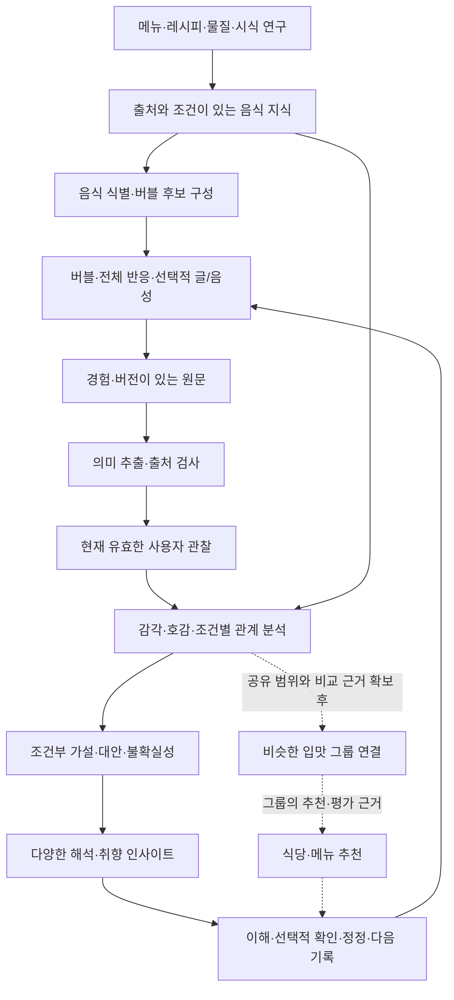

# TBA 미식 데이터 플랫폼 아키텍처

작성일: 2026-09-06 · 버전: 0.4 · 상태: 취향 이해·다양한 해석 우선의 장기 설계 및 규칙 우선 로컬 파일럿, 운영 구현·모델 성능 검증 전

**TBA의 최우선 목표는 사용자의 취향을 이해하고, 근거가 있는 다양한 해석과 인사이트를 제공하는 것이다.** 원문과 출처를 보존하며 데이터를 정제하여 같은 관찰을 여러 관점의 출력에 재사용한다. 이후 비슷한 입맛 그룹과 연결하고, 그 그룹의 추천·평가에 기반한 식당·메뉴 추천을 추가한다.

이 문서는 「TBA 피드백 루프 분석 질문」(`01a0711b-baa6-70d0-bcf9-4975d13d20be`)에서 정리한 설계를 이어간다. 사용자가 선택한 범위는 **기존 구조에 얽매이지 않는 장기 플랫폼**이다. 현재 TBA의 계산식·DB·완료 상태를 새 설계의 전제로 두지 않는다. 기존 버블 UI를 사용할 수 있으며 하드웨어는 선택적 입력 계층이다.

- 입력 의미와 수명주기: [수집·분해·정제 계약](./tba-sensory-data-design.md)
- 탐색과 입력: [버블 맵](./tba-bubble-map-design.md), [디시 종류](./tba-dish-tags-design.md), [메뉴 자동 태깅](./tba-menu-auto-tagging-design.md)
- 이번 설계의 계산·판단 기준: [분석·해석 모델](./tba-analysis-interpretation-model.md)
- 이번 설계의 검토 사례: [모델 입출력 계약 예시](./tba-model-contract-examples.json)
- 실제 자료를 연결한 실행 범위와 결과: [로컬 데이터 파일럿 보고서](./tba-platform-pilot-report.md)

## 1. 제품 목표와 우선순위

1. **개인 취향 이해·해석·인사이트:** 사용자가 무엇을 어떻게 느꼈고, 어떤 음식·조건에서 무엇을 좋아하는지 이해하도록 돕는다. 가벼운 기록에서 다양한 관점을 제공하는 것이 첫 제품 가치다.
2. **비슷한 입맛 그룹 연결:** 누적된 취향 근거를 바탕으로 다른 사람들과의 유사점과 차이를 설명하고 연결한다. 개인 취향을 고정된 그룹 라벨 하나로 대체하지 않는다.
3. **그룹 기반 식당·메뉴 추천:** 비슷한 입맛 그룹의 명시적 추천, 긍정 평가, 실제 경험을 구분해 식당과 메뉴 탐색에 연결한다.

개인 해석과 인사이트는 그룹 연결·추천이 없어도 독립적으로 가치가 있어야 한다. 추천 클릭률, 예약 전환, 다음 식사의 만족도는 후속 추천 계층의 평가 기준이며 최우선 제품 목표를 대신하지 않는다.

| 결과 | 답할 질문 | 표현 예시 또는 범위 |
| --- | --- | --- |
| 경험 요약 | 이번에 무엇을 느끼고 평가했는가? | “전체적으로 좋았고, 소스의 단맛은 후반에 부담스러웠어요.” |
| 감각별 취향 | 어떤 감각을 보고했고 무엇을 직접 좋아했는가? | 감각 존재·강도·직접 호감을 분리한 프로필 |
| 음식·조건별 차이 | 어떤 음식·부위·시점에서 반응이 달랐는가? | “이번 기록에서는 튀김옷은 좋았고, 소스의 단맛은 부담스러웠어요.” |
| 조합·예외 | 전체 호감과 부분 평가가 어떻게 공존하는가? | “음식 전체는 아쉬웠지만 감칠맛 자체는 좋았다고 기록했어요.” |
| 변화와 반복 | 이전과 최근의 기록에서 어떤 차이가 있는가? | 비교 가능한 반복 경험이 있을 때만 경향·변화와 대안을 설명 |
| 미확정 지점 | 아직 무엇을 알 수 없고 어떤 확인이 도움이 되는가? | “깔끔하다는 표현이 어떤 감각을 가리키는지는 아직 미확정이에요.” |
| 그룹 유사점·차이 | 어떤 입맛 그룹과 무엇이 닮았는가? | 후속 단계. 비교 범위·공통 근거·다른 점을 함께 표시 |
| 그룹의 식당·메뉴 | 비슷한 입맛의 사람들이 어디서 무엇을 좋게 봤는가? | 후속 단계. 그룹의 추천·평가 출처와 내 취향에 참고할 근거를 연결 |

예시는 출력 형식을 설명하기 위한 가상 문장이다. 실제 출력에는 해당 문장을 뒷받침하는 경험과 적용 범위가 있어야 한다. 개인을 고정된 미각 유형으로 판정하거나 근거보다 넓은 정체성을 만들지 않는다.

최우선 성공 기준은 **사용자가 적은 기록 부담으로 자신의 취향을 더 잘 이해하고, 근거에 충실한 해석에서 유용한 발견을 얻는가**다. 원문 일치·조건과 예외의 보존·사용자의 이해와 정정 가능성·반복 문장을 제외한 관점의 유용성을 함께 확인한다. 출력 개수만을 성공 지표로 삼지 않는다.

## 2. 핵심 결정

1. **경험이 기본 단위다.** 한 사람이 실제 음식을 먹은 한 번을 `Experience`로 식별한다. 태그 수·재분석 수는 경험 수가 아니다.
2. **음식 지식과 사용자 관찰의 저장 경로를 구분한다.** 메뉴에서 추정한 바삭함과 실제 선택한 바삭함은 같은 증거가 아니다.
3. **감각·호감·선택을 각각 분석한다.** 버블만 있어도 감각 기록을 활용하고, 전체 평가만 있어도 음식 호감을 학습할 수 있다.
4. **정제한 근거를 다양한 출력에 재사용한다.** 프로필은 조건과 근거가 있는 상태다. 6축 카드·문장·조건 비교·그룹 비교 특징은 같은 원본에서 재생성하는 출력이다.
5. **예측과 설명을 따로 검증한다.** 추천을 잘 맞혔다고 그 이유까지 증명된 것은 아니다.
6. **LLM은 의미 추출과 근거의 문장화를 돕는다.** 저장 승인, 학습 대상 선정, 추천 점수, 근거 수는 명시적인 코드와 모델 계약이 결정한다.
7. **장기 확장을 위한 계약을 먼저 둔다.** 처음에는 하나의 API와 작업 처리기로 운영하고, 부하와 조직 경계가 확인되면 분리한다.

## 3. 전체 흐름



`음식 지식 → 사용자 관찰`의 직접 변환 경로는 두지 않는다. 지식은 음식 식별·해석 맥락·후속 예측을 돕고, 사용자에게서 실제로 받은 응답만 개인 관찰로 저장한다. 해석 문장과 그룹의 평가도 해당 사용자의 관찰로 다시 넣지 않는다.

## 4. 음식과 경험의 식별 체계

### 4.1 같은 이름을 같은 음식으로 묶지 않는다

| 개체 | 의미 | 예시 |
| --- | --- | --- |
| `FoodConcept` | 일반적인 음식·재료 개념 | 돈가스, 돼지고기, 튀기기 |
| `RecipeVersion` | 출처가 있는 재료·조리 구성 | 레시피 A의 2번째 버전 |
| `MenuOfferingVersion` | 한 식당에서 특정 기간 판매한 메뉴 | 식당 A의 등심 돈가스, 9월 구성 |
| `Serving` | 특정 식사에서 실제 제공된 음식 | 오늘 받은 돈가스 한 접시 |
| `Meal` | 함께 먹은 음식과 상황의 묶음 | 오늘 점심 |
| `Experience` | 한 사용자가 그 음식을 먹은 경험 | 사용자 U의 오늘 돈가스 경험 |
| `Component` | 기록이 가리키는 구성 부분 | 튀김옷, 속살, 소스 |

연결은 `개념 ← 레시피/판매 메뉴 ← 실제 제공 음식 ← 개인 경험`이다. 같은 이름의 메뉴도 식당·구성·제공 상태가 다를 수 있다. 레시피를 모르는 판매 메뉴도 허용하며, 메뉴를 모르는 부분 경험도 저장한다. 공유 접시를 여러 사람이 평가하면 각각의 경험을 두고 공유 제공 음식과 식사로 관련성을 남긴다.

`experienced_at`과 `recorded_at`은 별도다. 식사 시각을 모르면 시간 정밀도를 남긴다. 물리적으로 공유한 식사와, 같은 사람이 함께 기록한 여러 디시를 구분할 수 있도록 `shared_meal_ref`는 선택적으로 둔다.

### 4.2 음식 관계와 미각 단어 관계

음식 그래프에는 `is_a`, `has_ingredient`, `prepared_by`, `served_with`, `version_of`처럼 종류가 정해진 관계를 둔다. 관계마다 방향·대상 타입·출처·확인 상태를 기록한다. FoodOn은 음식·원재료·가공 과정의 표준 개념을 연결하는 근거로 사용할 수 있다. [FoodOn 공식 설명](https://foodon.org/)

버블 그래프에는 `more_specific`, `similar_sensation`, `contrast`, `context_neighbor`를 둔다. `아몬드 같은 향`과 `아몬드 재료`는 다른 개체다. 단어의 이웃 관계, 재료 분류 관계, 화합물 공유 관계를 하나의 유사도 점수로 합치지 않는다.

이름 연결은 검토한 별칭·토큰·언어·음식 범위로 판정한다. `Sockeye`의 `eye`, `굵게`의 `게`처럼 단어 일부가 겹친다는 이유로 식품을 연결하지 않는다. 불명확하면 여러 후보와 미확정 상태를 반환한다. 연결 후보 생성과 실제 채택은 별도 단계다.

## 5. 저장할 데이터의 계약

다음은 논리적인 개체다. 초기 구현에서 각각 별도 서비스나 데이터베이스를 만들라는 의미는 아니다.

| 개체 | 필수 정보 | 다른 계층과의 관계 |
| --- | --- | --- |
| `SourceRegistry` | 출처, 버전, 가져온 시각, 원문 위치, 해시, 이용 범위 | 외부 데이터의 모든 행과 연결 |
| `FoodClaim` | 주체, 관계, 값/대상, 출처 구절, 적용 조건, 확인 상태 | 식당 설명·분류·레시피·사진 추정을 보관 |
| `CompoundMeasurement` | 물질 ID, 시료, 함량, 단위, 기준, 분석법, 검출 한계 | 해당 시료에 관한 음식 지식 |
| `SensoryStudyObservation` | 시료, 평가자/패널, 실험 절차, 척도, 감각 평가, 시점 | 연구 데이터. 앱의 개인 기록과 별도 출처 |
| `InputEvent` | 사용자, 경험 참조, 변경 ID, 기준 버전, 연산, 답변, 제시 화면 | 원문과 사용자의 수정 의도 |
| `Observation` | 원본 답변 참조, 종류, 대상, 속성, 값, 시점, 척도, 해석 상태 | 사용자 명시 응답에서 추출 |
| `ObservationSet` | 경험별 현재 버전, 유효 관찰 목록, 처리 버전 | 수정·취소를 적용한 학습 입력 |
| `FeatureSnapshot` | 예측 시각, 당시 사용 가능했던 특징, 결측, 출처, 특징 버전 | 학습과 실제 추천이 같은 정보를 사용하게 함 |
| `ModelArtifact` | 학습 자료 버전, 모델 설정, 평가 결과, 적용 범위, 파일 해시 | 재현·비교·이전 모델 복원 |
| `UserModelState` | 사용자, 공유 모델 버전, 근거 집합 해시, 개인 파라미터·불확실성 | 현재 유효 관찰로 재생성 가능 |
| `Hypothesis` | 주장, 적용 조건, 직접/동시 관찰/반대 근거, 대안, 상태 | 분석 결과를 설명 가능한 형태로 보관 |
| `DerivedView` | 출력 종류, 근거 참조, 허용된 주장, 생성 버전, 생성 시각, 무효화 상태 | 경험 요약·감각 프로필·조건 비교·변화·미확정 정보 등 다양한 출력 |
| `GroupComparisonFeatures` | 개인의 비교 가능한 감각·호감·조건, 결측, 근거 범위, 버전 | 추후 비슷한 입맛 그룹과의 유사점·차이 비교 준비 |
| `ExposureEvent` | 노출 후보, 실제 노출, 순서, 정책, 선택·무응답, 알려진 무작위 확률 | 추천과 질문의 평가에 사용 |

모든 사용자 자료에는 소유자와 접근 범위를 둔다. `Observation`의 출처는 실제 답변이어야 한다. 외부 리뷰는 외부 작성자의 진술로 분류하며 로그인한 사용자의 경험으로 가져오지 않는다. AI가 쓴 문장을 다시 학습 관찰로 집계하지 않는다.

### 5.1 신뢰도를 하나의 필드로 압축하지 않는다

- `source_quality`: 원출처와 측정 절차를 검토한 상태.
- `entity_resolution`: 이 음식·재료 연결을 채택할 근거와 미확정 후보.
- `extraction_resolution`: 원문에서 의미를 어느 정도 확정할 수 있는지.
- `evidence_coverage`: 음식·식사·시점·질문 범위와 유효 관찰 수.
- `predictive_uncertainty`: 모델이 예상하는 결과 분포와 보정 검증 상태.
- `claim_status`: 직접 관찰인지, 잠정 해석인지, 반대 근거가 있는지.

이 값들은 역할이 다르므로 곱하거나 평균 내어 “TBA 정확도 84%”로 표시하지 않는다. 실제 정확도를 뜻하는 숫자는 별도 평가를 거친 지표에만 붙인다.

### 5.2 실제 자료 파일럿에서 구체화한 저장 규칙

출처가 있는 자료도 내부적으로 충돌할 수 있다. 파일럿의 가루장국 원문은 분류에 비가열·절임을, 조리법에 삶기·끓이기를 함께 담고 있었다. `FoodClaim`에 양쪽 구절을 보존하고 충돌 상태를 표시하며, 한쪽을 자동으로 덮어쓰지 않는다. 같은 이름의 가자미미역국 두 원본도 별도 레시피로 유지한다.

파일럿은 원본 파일 해시뿐 아니라 선택한 레코드의 ID·해시·필드 위치를 보존한다. 그래야 원본의 어느 부분이 바뀌어 재검토가 필요한지 확인할 수 있다. 파생 카탈로그의 출처와 그 카탈로그가 참조하는 최초 원자료도 구분한다.

사용자 관찰의 참조에는 원본 답변 ID 외에 경험과 소유자가 일치한다는 제약이 필요하다. `InputEvent → Answer → Observation → DerivedView` 연결을 DB에서 검사하여 다른 경험이나 사용자의 근거가 섞이지 않게 한다. 실제 인증과 접근 제어는 이 참조 검사 위에 추가해야 한다.

### 5.3 한 번 정제한 데이터에서 다양한 출력을 만드는 계약

정제의 목적은 **원래 의미를 보존하면서 비교·조합·재해석할 수 있는 공통 근거를 만드는 것**이다. 처음 만드는 카드나 추천 점수에 맞춰 원본을 압축하지 않는다.

| 계층 | 보존할 것 | 재사용 방식 |
| --- | --- | --- |
| 원문 | 실제 답변·질문·선택지, 출처, 버전, 수정·삭제 상태 | 새로운 추출 규칙을 검토하거나 의미를 정정할 때 기준 |
| 정제 관찰 | 경험·식사·음식, 감각 종류·속성·존재·강도·호감, 대상·시점·맥락, 척도, 결측과 미확정 | 특정 출력에 종속되지 않는 공통 분석 입력 |
| 관계와 해석 | 적용 조건, 비교 가능한 근거, 동시 관찰·직접 지지·반대 근거, 대안 | 감각별·음식별·부위별·시간별 관점으로 해석 |
| 출력 뷰 | 출력 유형, 사용한 근거 ID, 범위, 생성 규칙 버전, 무효화 상태 | 문장·카드·프로필·비교·그룹 연결·후속 추천으로 표현 |

새 출력 유형은 공통 근거를 읽는 생성기로 추가한다. 감각의 존재를 호감으로, 결측을 0이나 싫어함으로 바꾸지 않는다. 단위·척도가 다르면 변환 근거 없이 합치지 않고, 아직 정의되지 않은 자유 표현은 원문과 미확정 상태를 남긴다. 다양성은 음식·부위·상황·조합·시간 등 근거가 허용하는 관점을 넓히는 것이며, 같은 내용을 여러 문장으로 복제해 새 발견으로 세지 않는다.

각 출력의 `evidence_refs`는 같은 활성 관찰 집합으로 돌아가야 한다. 출력 생성은 원본이나 관찰을 수정하지 않는다. 수정·취소·삭제되면 그 관찰에 의존하는 모든 출력이 재생성·무효화되어야 한다. 근거가 부족한 변화·그룹 유사성·추천은 해당 출력에서 미확정으로 남긴다.

## 6. 외부 데이터를 붙이는 순서

외부 자료는 이름 목록, 시식값, 물질 분석값, 개인 선호 데이터를 구분해 도입한다. 아래 활용은 TBA의 설계 제안이며 해당 제공자가 TBA의 추천 성능을 보장한다는 뜻이 아니다. 공개 설명 확인과 서비스용 데이터 반입 승인은 별도 상태다.

| 계층 | 자료 후보와 확인 근거 | TBA에서 사용할 내용 | 도입 조건 |
| --- | --- | --- | --- |
| 음식 이름·관계 | [FoodOn](https://foodon.org/), 저장소의 [음식 지식 자료](../../data/food-knowledge/README.md) | 표준 ID, 한국어 별칭, 재료·가공 과정·메뉴 연결 | 이름 매핑·상하위 관계 검수 후 반입 |
| 실제 메뉴·조리 | 식당 메뉴, 검토된 레시피, 보유 향토음식 자료 | 판매 메뉴와 조리 구성, 변경 이력 | 출처별 이용 조건과 메뉴의 유효 기간 기록 |
| 실제 감각 평가 | [WUR Taste, Fat and Texture Database](https://research.wur.nl/en/datasets/taste-fat-and-texture-database-taste-values-dutch-foods/) | 네덜란드 음식의 상대적인 맛 강도를 외부 비교 자료로 활용 | 원자료·척도·패널·이용 조건 확인 후 평가. 한국 메뉴의 정답값으로 대입하지 않음 |
| 감각 표현과 기준 | [WCR Sensory Lexicon](https://worldcoffeeresearch.org/read-more/news/174-world-coffee-research-sensory-lexicon) | 표현 정의와 기준 시료를 만드는 방법 참고 | 커피 어휘의 한국 일반 음식 적용은 검증. 개인용 무료 배포를 서비스 재배포 허가로 해석하지 않음 |
| 물질 식별 | [ChEBI](https://www.ebi.ac.uk/chebi/) | 분자·이온·물질의 표준 식별자와 관계 | 물질 형태와 동일성 확인, 출처별 이용 범위 등록 |
| 식품의 물질 함량 | [FooDB](https://foodb.ca/downloads), 검토한 식품 성분표·원논문 | 식품·시료와 성분·함량 연결 | FooDB 공개 페이지는 CC BY-NC 4.0을 명시하므로 상업 서비스 반입은 이용 조건 해결 전 보류 |
| 향미 물질·실험 | [Flavornet](https://www.flavornet.org/), 감각 실험 원논문 | 향기 성분의 감각 표현과 실험 조건 | 실험값과 추정값 구분. 접근 가능하다는 이유로 데이터 사용 권한을 가정하지 않음 |
| 개인 호감·선택 | TBA 자체 식사 기록과 실제 선택 결과 | 우리 사용자·메뉴·입력 방식에 맞는 학습과 평가 | 소유권·공유/학습 범위와 삭제 반영 계약 |

Recipe1M+ 같은 이미지·레시피 자료나 일반 리뷰 데이터는 메뉴 식별·문장 처리의 후속 후보로 둔다. 데이터 이름이나 크기만으로 취향 학습 자료로 채택하지 않는다. 사진을 보고 예상한 맛은 `anticipated_sensory`, 실제 먹고 평가한 맛은 `tasted_sensory`로 구분한다.

자료별로 `reference_only`, `review_pending`, `approved_for_named_use`, `restricted`, `retired` 상태와 사용 목적을 등록한다. 현재 단계에서는 대용량 원자료 다운로드와 상업 서비스 반입을 수행하지 않았다.

### 6.1 글루탐산 같은 물질 데이터의 자리

연결은 다음 단계로 나눈다.

```text
물질의 정확한 정체
→ 특정 재료·시료에서의 존재/함량
→ 조리·농도·매질·혼합 조건에 따른 감각 실험
→ 실제 메뉴에서 가능한 감각의 추정
→ 사용자가 보고한 감각
→ 그 경험에 대한 호감
```

중간 근거가 없으면 연결을 미확정으로 남긴다. 예를 들어 글루탐산과 일부 뉴클레오타이드의 혼합이 감칠맛 평가에 영향을 준 실험을 찾을 수 있지만, 특정 식당의 육수나 개인의 호감을 자동으로 알 수 있는 것은 아니다. 이 연결을 조건부 지식으로 보관하는 것은 TBA의 설계 판단이다. [사람을 대상으로 한 혼합 감각 실험](https://pubmed.ncbi.nlm.nih.gov/41092136/)

물질 관련 행에는 다음 조건을 보존한다.

- **분석 대상:** 유리 글루탐산, 총 아미노산 분석값, 특정 염·이온을 같은 값으로 합치지 않는다. 분석 대상이 불명확하면 `analyte_form=unknown`으로 둔다.
- **시료 기준:** 생것/조리 후, 수용액/식품, 가식부/전체, 습중량/건중량, `mg/100g`/`mmol/L` 등. 환산에 필요한 정보가 없으면 단위를 유지한다.
- **측정 조건:** 분석법, 검출·정량 한계, 범위, 온도·농도·혼합 물질 등 보고된 조건. 누락은 0이 아니다.
- **감각 절차:** 훈련 패널/일반 소비자, 맛/향/자극, 검출/인지/강도/호감, 실험 시료와 척도.
- **적용 범위:** 재료·조리·인구집단·음식 범위와 실제 메뉴로의 연결 근거.

식재료가 비슷한 향미 물질을 공유한다는 사실은 후보를 찾는 특징이 될 수 있다. 이를 개인 호감의 법칙으로 채택하지 않는다. 향미 네트워크 연구도 요리 문화별로 다른 조합 경향을 보고한다. [원연구](https://arxiv.org/abs/1111.6074)

## 7. 의미 사전과 입력 처리

845개 버블 후보는 어휘 자산이다. 원본 ID·라벨을 보존하며 실행용 의미 사전에는 각 표현별로 다음 정보를 둔다. 항목마다 해석 가능·일부 미확정·미확정 상태와 이유를 기록하며, 어휘 전체가 일반 사용자에게 검증되었다는 뜻으로 사용하지 않는다.

```text
descriptor_id, locale, label, definition_version
applicable_contexts, source_question_scope
semantic_atoms: kind + attribute + value + target + phase + scale_ref
unresolved_fields, candidate_senses, prohibited_inferences
review_status, reviewed_examples, meaning_version
```

입력은 **규칙 우선 → 필요한 문맥만 AI 추출 → 근거 검사 → 현재 유효 관찰 → 여러 해석** 순으로 처리한다. 규칙이 해결한 입력과 원문 자체의 정보가 부족한 입력은 API를 호출하지 않는다. 조회·요약 재생성에도 API를 호출하지 않으며, 동일 원문과 처리 버전의 추출 결과를 재사용한다. 구체적인 호출 경계는 [수집·분해·정제 계약](./tba-sensory-data-design.md#41-규칙-처리와-ai-호출의-경계)을 따른다.

| 입력 | 의미 사전이 만들 결과 | 채우지 않을 값 |
| --- | --- | --- |
| 바삭한 | 식감 존재 | 호감, 객관적인 바삭함 수치 |
| 진한 감칠맛 | 감칠맛 존재 + 그 표현 척도에서 강함 | 감칠맛 선호 |
| 너무 단 소스 | 소스 단맛이 원하는 수준보다 많음 | 당도, 전체 음식의 낮은 평가 |
| 그 바삭함이 좋았어요 | 해당 식감에 대한 직접 긍정 | 모든 튀김의 선호 |
| 아몬드 같은 향 | 비유로 표현한 향 | 아몬드 재료의 실제 포함 |
| 깔끔한 | 원래 표현과 가능한 뜻 | 임의로 낮은 지방감·짧은 여운 확정 |

명확한 선택지는 정의된 규칙으로 처리한다. 자유문장은 LLM이 추출 후보를 만들 수 있으나 원문 구절·부정·대상·시점 검사를 통과해야 한다. 알려진 음식명과 과거 프로필은 모호함의 후보를 좁히는 보조 자료이며 원문을 바꾸지 않는다.

노출된 후보, 실제 선택, 자동 분류 태그, 사용자가 해제한 태그를 구분한다. 메뉴 분류가 늦게 도착해도 작성 중인 맵을 갑자기 바꾸지 않는 계약은 기존 설계를 따른다. 버블 수나 화면 완료 상태가 학습 가능 여부를 대신하지 않는다.

## 8. 저장·수정·삭제와 동기화

### 8.1 저장의 원자성과 재시도

1. 클라이언트가 로컬에 입력과 고유 `client_mutation_id`, `base_revision`을 기록한다.
2. 서버는 소유자·참조 범위·질문 버전을 검사한다. 같은 사용자와 변경 ID의 재시도는 기존 결과를 반환한다. 같은 ID에 다른 payload가 오면 충돌로 반환한다.
3. 하나의 트랜잭션에서 원문 이벤트, 경험의 새 버전, 비동기 작업용 outbox를 기록한다.
4. 추출·관찰 갱신·개인 상태 갱신·해석을 작업 처리기가 수행한다. 소비자는 처리 키에 유일성을 두어 중복 전달에도 기여를 한 번만 적용한다.
5. 작업 완료 시 기준 버전과 현재 버전을 비교한다. 늦게 끝난 이전 버전의 분석이 새 결과를 덮어쓰지 않는다.

오프라인 저장을 허용한다. LLM 실패나 지식 검색 실패가 기록 저장을 실패시키지 않는다. 사용자가 즉시 볼 수 있는 응답 요약과, 서버 분석 완료 후의 해석 상태를 분리한다.

같은 답변을 바꾸지 않고 저장하면 새 지지 근거가 아니다. 서로 다른 기기의 같은 답변 수정은 자동으로 모두 채택하지 않고 `base_revision` 충돌로 반환한다. 서로 겹치지 않는 답변의 변경만 명시적 병합 규칙으로 병합한다. 두 음식을 비교하는 입력은 기존 경험을 참조하고 새 식사 수를 만들지 않는다.

### 8.2 삭제는 파생 자료까지 도달한다

`답변/경험 삭제 → 활성 관찰 제외 → 개인 상태 재계산 → 해석·추천 캐시 무효화 → 검색 인덱스·미디어·분석 사본 삭제 작업`을 추적한다. 삭제 요청 직후에는 해당 자료를 조회·새 학습·새 설명에서 제외한다. 비동기 정리가 완료된 범위를 별도 기록한다.

삭제를 다른 기기로 전달하는 표식에는 원문을 넣지 않는다. 늦은 동기화나 백업 복원으로 삭제 자료가 되살아나지 않도록 삭제 세대와 복원 절차를 둔다. 원문 버전 보존 정책에도 사용자 삭제를 적용한다.

이미 공유 모델 학습에 들어간 자료는 `training_manifest`로 영향 범위를 찾는다. 개인 전용 상태는 즉시 무효화·재계산하고, 공유 모델은 삭제 자료를 제외한 새 학습이나 검증된 제거 절차로 교체한다. 최초 플랫폼은 공유 모델의 주기적 재학습 경로를 선택한다. 완료 시점 전에는 모델 영향까지 모두 제거됐다고 표시하지 않는다.

## 9. 실제 서비스 구성

| 책임 | 초기 구성 제안 | 분리·확장 조건 |
| --- | --- | --- |
| 기록·메뉴·권한·버전 | PostgreSQL 기반 API, 현재 Supabase는 사용 가능한 후보 | 트래픽·팀 책임·장애 격리가 필요할 때 기능별 분리 |
| 원문 파일·외부 스냅샷·모델 | 객체 저장소, 참조·해시는 DB에 보관 | 대량 자료의 수명주기·지역별 보관 요구 |
| 비동기 분석 | DB outbox와 재시도 가능한 작업 처리기 | 작업 지연·독립 소비자가 늘 때 전용 메시지 시스템 |
| 음식 그래프 | 타입이 있는 개체·관계 테이블 | 다단계 그래프 조회의 실제 병목이 확인될 때 전용 그래프 저장소 |
| 검색 | 이름·별칭 검색과 검토된 관계 탐색 | 의미 검색의 이득을 검증한 뒤 벡터 검색 추가 |
| 통계 모델 학습 | API와 분리된 Python 작업, 버전 있는 산출물 | 학습량에 따른 전용 실행 환경 |
| 예측 제공 | 가벼운 모델·개인 상태를 읽는 서버 추론 | 응답 지연·확장 요구에 따라 전용 추론 서비스 |
| 앱 | 버전 있는 입력 사전·로컬 기록·작은 조회 캐시 | 검증한 일부 오프라인 추론만 추가 |
| 평가·분석 | 학습용 스냅샷과 운영 DB의 읽기 부하 분리 | 조회 부하와 데이터량에 맞춰 분석 저장소 도입 |

서비스 분리 수와 모델 복잡도는 장기성의 기준이 아니다. 이벤트, 음식 관계, 모델, 해석의 계약을 독립적으로 교체할 수 있게 만드는 데 우선순위를 둔다.

### 9.1 주요 API 계약

다음 경로는 새 플랫폼의 제안이며 현재 앱에 구현된 API 목록이 아니다.

| API | 역할 | 응답의 핵심 |
| --- | --- | --- |
| `POST /v1/experience-events` | 새 입력·수정·취소 저장 | 수락된 버전, 변경 ID, 분석 상태 |
| `POST /v1/menu-resolution` | 메뉴와 구성 후보 연결 | 후보·근거·미확정 필드·분류 버전 |
| `GET /v1/experiences/{id}/interpretation` | 현재 기록의 해석 | 근거 버전, 직접 관찰, 허용된 가설, 미확인 정보 |
| `GET /v1/taste-profile` | 조건별 개인 상태 | 관측 범위, 잠정 패턴, 반대 근거, 최신 반영 버전 |
| `GET /v1/taste-insights` | 개인 취향의 다양한 해석 | 출력 유형별 인사이트, 근거·조건·예외·미확정 상태 |
| `GET /v1/palate-groups` | 후속 단계의 비슷한 입맛 그룹 연결 | 유사점·차이·비교 근거·공유 범위 |
| `POST /v1/recommendations` | 후속 단계의 그룹 기반 식당·메뉴 후보 | 그룹의 추천·평가 출처, 개인 관련성, 예측 상태·노출 ID |
| `POST /v1/exposures` | 실제 화면 노출과 반응 기록 | 멱등 처리 결과 |
| `DELETE /v1/experiences/{id}` | 경험과 의존 자료 삭제 요청 | 조회 제외 상태, 정리 작업 ID |

사용자 ID는 요청 본문을 신뢰해 결정하지 않고 인증된 주체에서 얻는다. 공개 프로필과 소셜 추천은 사용자가 허용한 공개 자료로 만든 별도 조회 모델을 사용한다. 공개 API에 내부 개인 관찰과 비공개 반대 근거를 그대로 포함하지 않는다.

LLM 호출에는 필요한 원문 구절과 허용된 근거만 전달한다. 외부 리뷰·메뉴 문장은 처리할 자료이며 도구 실행이나 데이터 변경 지시로 취급하지 않는다. 문장 생성기가 임의 SQL·점수 갱신·외부 메시지 발송을 결정하는 구조는 이 설계에 필요하지 않다.

## 10. 단계별 구축 순서

| 단계 | 완성할 것 | 다음 단계로 넘어갈 조건 |
| --- | --- | --- |
| A. 근거 계약 | 경험·원문·관찰·현재 버전·노출·삭제 흐름 | 출처 추적, 재시도, 수정·삭제, 부분 입력의 계약 사례 통과 |
| B. 의미와 음식 지식 | 대표 음식군의 의미 사전, 메뉴·재료 연결, 출처 등록 | 잘못된 연결·부정·대상·시점의 검토 자료와 보류 규칙 확보 |
| C. 다양한 개인 해석 | 같은 정제 근거에서 경험 요약·감각 프로필·조건 차이·미확정 정보를 생성 | 근거 추적, 의미 구분, 사용자 이해·유용성, 수정·삭제의 모든 출력 반영 |
| D. 취향 관계·변화 인사이트 | 음식·감각·강도·조합·시점별 패턴과 예외, 필요한 통계 모델 | 주장 유형별 검증과 반대 근거 처리. 미래를 예측하는 주장에만 해당 예측 검증 추가 |
| E. 비슷한 입맛 그룹 | 비교 가능한 개인 근거와 유사점·차이를 가진 그룹 연결 | 공유 범위, 유사성의 타당성, 결측·소수 근거·그룹 내 차이 처리 |
| F. 그룹 기반 식당·메뉴 추천 | 그룹의 추천·평가와 식당·메뉴 후보, 개인 맥락, 실제 노출·반응 연결 | 출처와 개인 관련성 확인, 인기/유사 메뉴 기준 대비 후속 추천 가치 평가 |
| G. 추가 확장 | 물질·시식 특징, 정교한 변화·선택 모델, 필요 시 그래프 임베딩 | 해석·그룹 연결·추천 중 목표한 계층의 이득이 비용 대비 확인됨 |

대표 음식군은 튀김·국물면·구이·크림소스 요리·커피를 첫 검토 후보로 둔다. 이 범위에서 같은 메뉴의 반복, 서로 다른 메뉴의 공통 감각, 음식 전체와 부분 평가의 차이를 먼저 검토한다. 전체 어휘·세계 메뉴·물질 데이터를 한 번에 모델에 넣지 않는다.

기존 자산은 재사용 후보로 연결하되, 기존 자동 태그·파생 평점·신뢰도는 새 체계의 사용자 사실로 승격시키지 않는다. 원래 질문과 의미가 확인되는 기록만 변환하고 나머지는 `legacy_unresolved`로 보관한다. 원본 음식 데이터의 관계 복원·이름 정제 문제는 별도 반입 검수 대상으로 둔다.

개체·근거·저장·동기화·서비스 경계와 구축 순서를 정리했고, 로컬 파일럿에서는 보유한 음식 자료 7개와 가상 사용자 입력을 별도 PGlite DB에 연결했다. v2는 845개 표현의 의미 정의·미확정 사유, 짧은 글의 규칙 처리, 문맥 연결이 필요한 경우의 AI 호출 경로, `answerKey`별 원문과 추출 결과의 수명주기를 구현한다. 같은 활성 근거를 경험 요약·속성별 프로필·대상과 시점의 차이·반복 기록·조합·선호 수준·확인 후보로 재사용한다.

단계 A의 일부 저장 계약, 단계 B의 선별한 음식 근거, 단계 C의 정제·출력 재사용과 120개 고정 예문 회귀평가를 검증하는 범위다. 각 단계 전체의 완료나 실제 인사이트 유용성·일반 문장 정확도·실제 AI 모델 성능을 뜻하지 않는다. 이 파일럿 단계에서는 운영 DB 마이그레이션, 앱 UI 변경, 신규 외부 데이터셋 도입, 모델 학습·배포를 수행하지 않았다. 구체적인 실행 결과와 남은 제약은 [파일럿 보고서](./tba-platform-pilot-report.md)에 기록한다.

후속 [개인 취향 분석 엔진 v1](./tba-personal-engine.md)은 실제 입력과 가상 자료를 구분하는 로컬 저장, 개인 관계 인사이트, 아홉 타입의 메인·날개, 근거 중심 서술 경로까지 연결한다. C·D의 로컬 실행 범위를 넓힌 결과이며, 실제 사용자 유용성과 운영 앱 연결 검증을 대신하지 않는다.

후속 [감각 v2와 네이티브 앱 연결](./tba-native-sensory-integration.md)은 상세 감각 묘사·미해석 자료와 범위별 해석을 추가하고, 앱의 기존 점수·예시 해석 경로를 새 Swift 엔진 결과로 교체한다. 이 구현이 실제 사용자 의미 정확도·운영 DB·추천 완성을 뜻하지 않는다. 네이티브 원문에는 식사 묶음 ID가 없어 기록 개수와 JS의 명시적 식사 집계를 구분한다.
