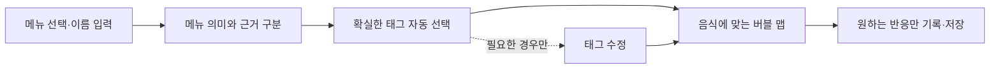

# TBA 메뉴명 기반 디시 태그 자동 선택

작성일: 2026-09-05 · 상태: 설계 초안 · 앱·분류기 구현 전

[디시 종류 설계](./tba-dish-tags-design.md) · [분류 데이터](./tba-dish-taxonomy.json) · [기대 출력과 수정 사례](./tba-menu-auto-tagging-examples.json)

## 1. 기본 경험

**메뉴를 선택하거나 이름을 입력하면, 근거가 충분한 디시 태그가 이미 선택된 상태로 나타나고 해당 버블 맵을 준비한다.** 사용자는 틀린 태그만 빼거나 바꾼다. 태그 확인 화면을 한 단계 더 만들지 않는다.

예를 들어 `돈까스`를 입력하면 메뉴명은 그대로 보관하고 `튀김`을 자동 선택한다. 사용자가 아무것도 수정하지 않아도 이 태그로 맵을 구성하고 기록을 저장한다. `돈까스`라는 메뉴 이름 자체를 종류 태그로 만들지는 않는다.

기존 메뉴 선택 영역에서 메뉴명 아래에 `메뉴명 기준`이라는 짧은 안내와 선택된 태그를 둔다. 태그를 누르면 해제되고, 기존 태그 편집 진입점에서 추가할 수 있다. 신뢰도 수치나 내부 분류 기준은 기본 화면에 노출하지 않는다.

자동 선택한 태그도 즉시 유효하다. 다만 **화면에서 선택되어 있음, 메뉴 정보에서 추정함, 사용자가 직접 확인함은 서로 다른 상태**다. 저장하거나 다음 화면으로 이동했다고 자동 선택을 사용자 확인으로 바꾸지 않는다.

메뉴명이 없거나 분류하지 못해도 공통 맵으로 기록할 수 있다. 메뉴 이름과 종류 태그를 모두 입력할 의무는 없다. 태그 요약 개수와 데이터 보관 개수도 구분하며, 화면에 세 개만 요약한다고 나머지 태그를 버리지 않는다.

## 2. 이름을 분해하는 순서

| 단계 | 처리 | 보존할 것 |
| --- | --- | --- |
| 원문 보관 | 메뉴 ID가 있으면 ID와 메뉴판 버전을 연결하고 입력 원문을 남김 | 원문, 입력 출처, 메뉴 버전 |
| 표기 정리 | 공백·대소문자·검토된 별칭을 검색용으로 정리 | `돈까스` 원문과 `돈가스` 검색용 이름을 함께 보관 |
| 음식 식별 | 검토된 전체 이름·별칭·복합어 규칙으로 음식 개념을 찾음 | 규칙 ID·버전과 실제 매칭된 부분 |
| 대상 분해 | 주된 음식, 소스, 속재료, 곁들임, 세트 구성의 범위를 구분 | 해당 태그가 가리키는 구성 요소 |
| 태그 판단 | 종류·요리 문화·재료·조리·소스를 태그별로 판단 | 각 태그의 근거와 충돌 여부 |
| 선택 반영 | 자동 선택 기준을 통과한 항목만 반영하고 사용자 수정 상태를 적용 | 자동 선택·제안·수동 선택·해제 이력 |
| 맵 구성 | 유효한 태그와 구성 요소에 맞는 가지를 조합 | 사용한 분류·맵 버전 |

한 글자나 단순 포함 여부로 분류하지 않는다. `회식 세트`의 `회`는 회 요리를 뜻하지 않고, `돈까스 소스`의 주된 대상은 소스다. 긴 이름을 먼저 찾는 것만으로도 충분하지 않으므로 **음식 이름이 쓰인 대상과 수식 관계**를 함께 확인한다.

`맛`, `향`, `스타일`, `비건`, `제외` 같은 표현도 버리지 않는다. `돈까스맛 과자`는 돈까스가 아니며, `비건 돈까스`에서 돼지고기를 자동으로 채우면 안 된다. `매운`, `바삭한`은 메뉴의 설명으로 남길 수 있지만 실제 감각 응답이 되지는 않는다.

새 음식 이름을 기존 태그에 억지로 맞추지 않는다. 예를 들어 일반 과자에 맞는 종류가 사전에 없으면 `초콜릿·견과 과자`로 임의 분류하지 않고 공통 맵을 제공하며 분류 사전 보완 대상으로 남긴다.

## 3. 언제 자동으로 선택하는가

태그마다 아래 기준을 적용한다. 메뉴 전체에 신뢰도 하나를 붙여 모든 태그를 함께 선택하지 않는다.

| 근거 | 기본 처리 | 조건 |
| --- | --- | --- |
| 해당 메뉴 ID에 연결된 검토된 분류 | 자동 선택 | 메뉴 ID·버전·종류 사전 버전이 맞고 현재 이름·설명과 충돌하지 않음 |
| 검토된 메뉴 이름·별칭 규칙 | 자동 선택 | 허용된 대상 범위에 매칭되고 수식어·부정·대체 재료와 충돌하지 않음 |
| 명확한 이름 구성 규칙 | 자동 선택 | `연어구이`의 연어·구이처럼 대상까지 구분한 규칙이 검토됨 |
| 요리의 관습적인 구성만으로 추정 | 제안 또는 내부 후보 | 이름이나 메뉴 자료에서 확인하지 못한 재료·소스·조리법 |
| 모델의 새로운 해석 | 기본은 제안 | 모델이 스스로 낸 높은 신뢰도 숫자만으로 자동 선택하지 않음 |
| 불명확하거나 근거가 충돌함 | 해당 태그는 미선택 | 충돌하지 않는 다른 태그는 자동 선택 가능 |

메뉴판 정보라고 무조건 검증된 것은 아니다. OCR로 읽은 이름의 불확실성도 분류에 전달한다. 이름이 불명확하면 후보를 보여줄 수 있으나, 실제로 사용자가 선택·입력한 메뉴명과 같은 출처로 취급하지 않는다.

요리 문화도 선택할 수 있다. 검토된 `짜장면` 규칙은 `면·중식`을 연결하지만, `카레`라는 이름 하나만으로 인도음식·일식 중 하나를 확정하지 않는다. 식당이 중식당이라는 정보도 모든 개별 메뉴를 중식으로 바꾸는 근거로 사용하지 않는다.

모델 기반 자동 선택은 이후 별도 평가에서 태그별 정확성과 입력 출처별 성능을 확인한 범위만 열 수 있다. 초기 설계는 검토된 사전·규칙으로 자동 선택하고 나머지는 제안으로 둔다. 실제 정확도나 확률 임계값이 검증됐다고 주장하지 않는다.

## 4. 기대되는 결과

아래는 해당 이름·구성 규칙이 검토됐을 때의 **설계상 기대 출력**이다. 현재 앱의 실행 결과나 분류 정확도 측정값은 아니다.

| 메뉴명 | 자동 선택되는 종류 태그 | 맵에 쓰는 추가 문맥·유보할 것 |
| --- | --- | --- |
| 돈까스 | 튀김 | 튀김 맵. 바삭함·기름진 느낌은 선택하지 않음 |
| 치즈돈까스 | 튀김 · 치즈 | 치즈 부분의 표현 후보. 우유 원료는 별도 확인 |
| 짜장면 | 면 · 중식 | 면과 소스의 가지. 단맛·불향은 응답으로 만들지 않음 |
| 크림 파스타 | 면 | 파스타 음식군·크림소스 문맥. 밥알 가지는 제외 |
| 크림 리조또 | 밥·곡물 요리 | 크림소스 문맥. 면 가지는 제외 |
| 연어 | 생선 | 조리법은 미확정. 회·구이를 자동 선택하지 않음 |
| 연어구이 | 구이 · 생선 | 생선구이 맵. 느낀 지방감은 별도 기록 |
| 김치 | 한식 · 발효음식 | 김치의 검토된 일반 음식 규칙. 겉절이 등 예외를 먼저 확인 |
| 김치찌개 | 찌개·전골 · 한식 | 발효 문맥은 김치 부분에 연결. 찌개 전체의 발효 공정으로 확대하지 않음 |
| 카레 | 향신료 음식 | 향신료 소스 맵. 요리 문화·매운 강도는 미확정 |
| 돈까스 덮밥 | 덮밥·볶음밥 · 튀김 | 밥과 돈까스의 대상 범위를 나눠 가지 조합 |
| 돈까스 소스 | 없음 | 소스 문맥만 보관. 튀김 맵을 자동 적용하지 않음 |
| 오늘의 스페셜 | 없음 | 메뉴 설명이 없으면 공통 맵으로 기록 |

`면`과 세부 음식군 `파스타`는 내부에서 연결하되 같은 의미를 두 번 선택하게 하지 않는다. 기본 요약에는 `면`을 보여주고, 내부 문맥에 `dish.pasta`를 보관해 맵을 구성한다. 사용자가 파스타를 직접 선택한 경우에도 중복 증거로 집계하지 않는다.

`돈까스 + 우동 세트`는 구성 요소별 분류를 보관한다. 화면에는 `튀김·면`을 요약할 수 있지만, 튀김옷 표현은 돈까스에 연결한다. 이름을 나눴다는 이유만으로 새 식사 경험이나 감각 응답을 여러 개 생성하지 않는다. 어느 구성의 느낌인지 사용자가 말하지 않았다면 미확정으로 둔다.

## 5. 사용자 수정과 다시 계산

종류 선택 모드는 `automatic`, `user_edited`, `user_empty`로 구분한다. 처음에는 자동 결과가 적용된다. 사용자가 하나라도 수정하면 해당 음식의 유효 선택 집합을 사용자 수정 상태로 보관하며, 후속 자동 결과는 제안으로만 추가한다.

| 사건 | 결과 |
| --- | --- |
| 자동 태그를 그대로 두고 저장 | 자동 출처·미확인 상태를 유지한 채 저장 |
| 자동 태그 하나를 해제 | 해제 이력을 저장. 같은 음식에서 재추정해도 다시 선택하지 않음 |
| 전부 해제 | `user_empty`와 빈 집합을 저장. 공통 맵 사용 |
| 제안·다른 태그를 직접 추가 | 해당 태그만 사용자 선택으로 보관. 다른 자동 태그까지 확인한 것으로 처리하지 않음 |
| 표기만 수정: 돈까스 → 돈가스 | 같은 음식 개념이면 기존 수정 상태 유지 |
| 다른 음식으로 정정: 돈까스 → 연어회 | 같은 경험의 분류 대상 버전을 갱신. 이전 음식의 태그·해제 이력은 새 대상에 적용하지 않고 이력으로 보관 |
| 기존 기록 다시 열기 | 저장 당시 선택 모드·빈 집합·버전을 복원. 빈 값만 보고 자동 추정하지 않음 |
| 사전·모델 버전 변경 | 과거 분류 원문을 덮어쓰지 않음. 필요하면 새 분류 버전을 따로 생성 |

음식 정정은 경험을 복제하지 않는다. 이미 고른 버블과 원문은 보존하고 해석 문맥을 새 분류 버전에 연결한다. 이전 음식의 특정 부위를 지칭한 관찰은 현재 음식으로 조용히 옮기지 않고 대상 확인이 필요한 상태로 둔다.

태그 제거는 해당 분류에 대한 정정이다. 그 맛을 싫어한다는 피드백으로 학습하지 않는다. 개인의 수정 한 번으로 공통 메뉴 사전을 즉시 바꾸지 않고, 개인 메뉴 문맥과 공통 사전 검토 후보를 구분한다.

## 6. 계산 시점과 화면 안정성

- 메뉴 목록에서 선택하면 연결된 분류를 즉시 사용하고, 직접 입력은 기존 메뉴 확정 동작에 맞춰 계산한다. 한글 조합 중인 글자로 맵을 반복 교체하지 않는다.
- 로컬 사전으로 가능한 결과를 먼저 준비한다. 서버·모델 응답을 기다리는 동안에도 기록과 저장을 계속할 수 있다.
- 요청에는 경험·분류 대상·메뉴 수정 버전·요청 ID를 붙인다. 현재 버전과 맞지 않는 늦은 응답은 화면에 적용하지 않는다.
- 사용자가 버블을 고르기 시작하면 태그와 맵 배치를 자동으로 바꾸지 않는다. 나중에 도착한 추가 분류는 선택적인 수정 제안으로 남긴다.
- 사용자가 직접 종류를 수정하면 맵 가지를 갱신하되 공통 표현의 위치와 이미 선택한 버블을 보존한다.
- 모델 오류·오프라인·사전 미등록은 공통 맵으로 처리한다. 태그 확인 질문에 답해야만 기록할 수 있게 만들지 않는다.

## 7. 저장할 정보

자동 선택은 메뉴 문맥으로 저장하고 감각 관찰과 분리한다. 다음 구조는 구현 계약의 초안이다.

| 자료 | 주요 필드 | 의미 |
| --- | --- | --- |
| 메뉴 입력 | `menu_name_raw`, `menu_id`, `menu_version`, `source_ref`, `input_revision` | 사용자가 고른 메뉴와 원문 |
| 분류 대상 | `classification_subject_id`, `subject_revision`, `component_id` | 같은 음식의 수정·별도 구성 요소를 구분 |
| 태그별 판단 | `entry_tag_id`, `context_tag_ids`, `target`, `origin`, `evidence_refs`, `rule_version`, `decision` | 왜 어떤 태그가 자동 선택·제안됐는지 |
| 선택 상태 | `selection_mode`, `effective_entry_tag_ids`, `user_actions`, `review_state` | 빈 집합·해제·수동 추가까지 복원 |
| 표시 기록 | `candidate_entry_tag_ids`, `presented_entry_tag_ids`, `map_version` | 준비된 후보와 실제 보인 태그를 구분 |
| 계산 기록 | `request_id`, `input_revision`, `taxonomy_version`, `classifier_version` | 늦은 응답과 버전 변경 처리 |

`origin`은 `menu_catalog`, `menu_name_rule`, `model_inferred`, `user` 등으로 보존한다. 사용자가 수정한 뒤에도 처음 근거와 이후 행동 이력을 잃지 않는다. 맵 조합에 사용한 자동 문맥은 `ContextFact`에 연결하고 `Observation`이나 취향 점수로 복제하지 않는다.

여러 세부 태그를 후보로 연결하는 입구 태그도 주의한다. `음료`를 선택했다고 커피·차·와인·맥주를 모두 선택한 것으로 저장하지 않는다. 해당 입구의 선택과 아직 미확정인 하위 후보를 따로 보관한다.

## 8. 현재 코드와 구현 시 바뀔 부분

현재 네이티브 `DiningFeedbackDishKindAutoSelection`은 메뉴 문맥과 키워드 추정을 합쳐 기본 최대 네 개의 기존 태그를 반환한다. 웹 `inferDishKindIds`는 이름·설명·재료·조리법·풍미 설명의 키워드 포함 수로 기존 태그를 정렬한다. 새 설계의 50개 입구 태그에 아직 연결된 것은 아니다.

네이티브 `resolvedSelectedDishKindIDs`와 웹 `getSelectedDishKindIds`에는 선택 집합이 비면 추정값을 사용하는 분기가 있다. 이 설계를 구현할 때는 **아직 계산하지 않음과 사용자가 모두 해제함을 별도 상태로 바꿔야 한다.** 이 문서는 코드의 분기를 확인한 정적 분석이며, 실기기에서 해제 문제를 재현한 결과는 아니다.

이후 구현은 원문·근거를 반환하는 분류 결과, 선택 상태를 보존하는 처리, 새 태그와 버블 맵 연결을 순서대로 적용한다. 기존 기록의 19개 태그는 당시 정의를 보존하고 명시적인 변환 버전을 통해 연결한다.

## 9. 검증 범위

[사례 데이터](./tba-menu-auto-tagging-examples.json)는 정상 메뉴·불명확한 이름·수식어·복합 요리·수정 상태의 기대 결과다. 참조 ID와 계약의 일관성을 확인하기 위한 자료이며 실행된 모델 출력이 아니다.

분류기를 구현한 뒤에는 작성 규칙과 겹치지 않는 메뉴·식당의 별도 평가 자료로 자동 선택 정확도, 자동 처리 비율, 태그별 오선택·누락, 사용자 수정 횟수, 기록 완료 시간, 메뉴 정정 후 잘못 재적용되는 비율을 측정한다. 사용자가 수정하지 않았다는 사실만으로 정답으로 채점하지 않는다.

자동 태그가 감각 선택에 미치는 영향도 검토한다. 같은 메뉴에서 표시된 분류·맵 버전을 기록하고, 소규모 사용성 평가에서 태그 없이 시작한 경우와 단어 선택·소요 시간·오해를 비교한다. 현재는 설계와 구조 검사까지이며 앱 빌드·실기기 시험·분류 정확도 평가는 수행하지 않았다.
