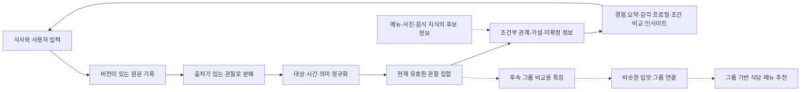

# TBA 미식 데이터 수집·분해·정제 설계

- 작성일: 2026-09-05
- 상태: 독립 설계 초안 v0.3 · 2026-09-06 규칙 우선 정제·조건부 AI·로컬 v2 시점 구분 반영
- 검토 자료: [입력별 구조화 예시](./tba-sensory-data-examples.json)
- 수집 어휘 확장안: [음식별 미각 버블 맵](./tba-bubble-map-design.md) · [디시 종류 태그](./tba-dish-tags-design.md)
- 입력 부담 축소: [메뉴명 기반 디시 태그 자동 선택](./tba-menu-auto-tagging-design.md)

후속 실행에서는 감각 상세 정제와 네이티브 앱 연결까지 구현했다. 현재 구현·검증 범위와 남은 의미 해석 한계는 [감각 모델과 앱 연결](./tba-native-sensory-integration.md)을 기준으로 확인한다. 이 문서의 장기 논리 모델 전체가 구현된 것은 아니다.

## 1. 목적과 설계 범위

사용자가 버블·태그·짧은 반응으로 남긴 최소 입력을 정제해, **개인의 취향을 이해하고 다양한 해석과 인사이트를 제공한다.** 같은 근거를 음식·감각·대상·시점·맥락별로 재해석하고, 추후 비슷한 입맛 그룹 연결과 그 그룹의 식당·메뉴 추천에 재사용한다. 여러 출력을 만들 수 있어도 독립된 경험의 수는 늘어나지 않는다.

이 문서는 수집 계약, 관찰 분해, 정제, 가설 생성, 수정·삭제 처리와 검증 사례를 정의한다. 현재 앱·DB의 동작을 설명하거나 기존 분류·점수·완료 상태를 유지하는 문서가 아니다. 모델의 수치 가중치와 실제 화면 구현은 후속 검증으로 결정한다.

설계의 기준은 다음과 같다.

- 식별된 음식에 대한 반응 하나만 남겨도 저장할 수 있다. 버블·전체 평가·디테일을 모두 채울 의무가 없다.
- 전체 평가, 감각 관찰, 특정 감각에 대한 평가, 다음 선택 의향을 별도 데이터로 다룬다.
- 관찰은 원문·질문·선택지로 추적할 수 있어야 한다. 자동 추정과 가설은 출처가 다른 자료다.
- 미응답·미선택·모름은 중립, 감각 부재, 싫어함으로 바꾸지 않는다.
- 학습은 유효한 관찰 단위로 허용한다. 화면의 완료 여부나 입력 개수가 의미를 대신하지 않는다.
- 다양한 관점의 출력을 만들 수 있는 공통 근거를 보존하고, 화면에서는 이해하기 쉬운 분량으로 보여준다. 내부에는 대안과 반대 근거를 함께 보관한다.

### 1.1 정제와 재해석의 경계

정제는 표기·식별자·관찰 종류·척도·출처를 일관되게 만드는 작업이다. 특정 카드 문장이나 추천 벡터로 원문을 대체하는 작업으로 사용하지 않는다.

| 공통 근거에 보존할 정보 | 서로 구분할 값 |
| --- | --- |
| 출처·수명주기 | 사용자 답변/외부 음식 지식/추정, 원문 위치, 질문·선택지·추출 버전, 수정·삭제 상태 |
| 경험·음식 | 사용자·경험·식사·음식 참조, 레시피·메뉴·제공 음식의 알려진 범위 |
| 감각 | 맛·향·식감·자극·온도·여운, 속성, 존재와 강도 |
| 평가 | 전체 호감, 감각 자체의 호감, 원하는 수준과의 차이, 선택 의향 |
| 적용 조건 | 음식 전체/소스/부위, 첫입/후반 등 시점, 명시한 상황 |
| 값의 의미 | 원래 값·단위·척도, 관측됨/미선택/모름/미확정, 가능한 뜻과 금지할 추론 |

원문과 정제 관찰을 함께 보존하되 출력별 문장·집계·축 표현은 별도 뷰로 만든다. 알려지지 않은 값을 0·0.5로 채우거나 6축·8축에 들어가지 않는 표현을 버리지 않는다. 감각 강도·존재·호감의 원래 의미와 단위는 변환 근거 없이 합치지 않는다.

새 출력은 같은 활성 관찰 집합에 생성 규칙을 추가해 만든다. 경험 요약, 속성별 프로필, 음식·부위·시점별 차이, 평가의 공존과 예외, 근거가 있는 변화, 미확정 정보, 그룹 비교용 특징을 각각 제공할 수 있다. 출력마다 근거 ID·범위·규칙 버전을 남기고 원문을 변경하지 않는다. 수정·취소·삭제 후에는 해당 근거에 의존하는 모든 출력을 재계산하거나 무효화한다. 생성한 문장이나 그룹 특징을 새 사용자 관찰로 되돌려 넣지 않는다.

## 2. 수집 계약

### 2.1 기록의 단위

기본 단위는 `experience_id`로 식별하는 **한 사람이 실제 제공된 특정 음식을 먹은 한 번의 경험**이다. 같은 메뉴의 재방문은 새 경험이며, 같은 경험의 수정은 새 버전이다.

한 식사에 여러 음식이 있으면 `meal_id`로 묶고 음식별 `experience_id`를 둔다. 음식 안의 소스·재료는 `target`으로 구분한다. 음식 전체와 코스 전체를 평가하는 질문은 서로 다른 대상을 가리킨다. 음식이 아직 식별되지 않았다면 부분 기록으로 보관하고, 확인된 범위를 넘어 다른 음식 기록과 합치지 않는다.

식사 시각을 모르면 정확도를 미확인으로 남긴다. 입력한 시각인 `recorded_at`을 식사 시각으로 자동 대체하지 않는다.

### 2.2 가벼운 기본 입력

메뉴가 정해진 뒤 한 화면에서 다음 중 원하는 만큼 남긴다.

| 입력 | 예시 | 남는 데이터 |
| --- | --- | --- |
| 전체 맛 반응 | `좋았어요 / 괜찮았어요 / 아쉬웠어요` | 해당 음식의 전체 호감, 순서형 범주 |
| 미각 버블 | `진한 감칠맛 / 훈연향 / 바삭함` | 기억에 남은 감각의 관찰 |
| 선택적 디테일 | `끝까지 남음 / 소스에서 느낌` | 관찰의 시간·대상·성질 보완 |
| 선택적 감각 평가 | `이 훈연향은 좋았어요` | 특정 감각에 대한 호감 |
| 선택적 직접 기록 | 짧은 글·음성 | 원문에서 확인할 수 있는 관찰 |
| 모름 또는 건너뛰기 | `잘 모르겠어요` | 미관측 사유 |

전체 반응의 세 범주는 제안된 제품 척도이며, 검증된 감각 측정 척도와 동등하다고 가정하지 않는다. `괜찮았어요`의 중립 의미가 사용자에게 전달되는지 검증한다. `잘 모르겠어요`는 별도 선택이다.

버블 하나를 고르면 저장할 수 있고, 디테일은 펼칠 때만 보인다. 글·음성은 기본 의무가 아니다. 저장 후 확인 질문을 받지 않아도 기록은 유효하다.

### 2.3 선택의 의미를 보존하는 규칙

- 질문 문구, 질문 대상, 표시한 선택지와 순서, 선택지 정의 버전, 실제 선택 여부를 함께 저장한다.
- `맛은 어땠어요?`에 대한 응답을 식당 서비스나 가격 평가로 확대하지 않는다.
- `이 훈연향은 어땠어요?`에 대한 응답은 훈연향에 붙인다. 전체 음식 평가로 복제하지 않는다.
- 디테일이 어느 버블에 붙는지는 사용자에게 보이는 질문·대상 표시로 결정한다. 화면 내부의 활성 인덱스만으로 대상을 추측하지 않는다.
- 감각 후보를 자동 선택하지 않는다. 제시된 후보, 사용자 탭, 시스템 추천 여부를 구분한다.
- 사진·메뉴명에서 얻은 재료·조리법 후보는 사용자의 감각 응답을 대체하지 않는다.
- 메뉴명으로 디시 종류 태그를 자동 선택해 맵 구성에 사용할 수 있다. 자동 선택·사용자 선택·해제 이력을 구분하며, 저장만으로 자동 분류를 사용자 확인이나 감각 관찰로 바꾸지 않는다.
- 응답 시간은 UX 진단에 사용할 수 있지만, 빠르거나 느리다는 이유만으로 사용자의 진술을 불신하지 않는다.

선택형 감각 표현은 소비자 연구에서도 사용되지만, 선택지의 구성·순서가 결과에 영향을 줄 수 있다. 버블 UI 자체의 기록 편의성과 표현 이해도는 별도 검증 대상이다. [CATA 선택의 의미 연구](https://www.sciencedirect.com/science/article/pii/S0950329319303817), [선택지 순서 연구](https://www.sciencedirect.com/science/article/pii/S0950329312001838)

## 3. 저장 계층과 최소 필드

### 3.1 저장 계층

| 자료 | 핵심 필드 | 역할 |
| --- | --- | --- |
| `Experience` | `experience_id`, `meal_id`, `user_ref`, `dish_ref`, `experienced_at`, `time_precision` | 실제 식사 경험의 식별 |
| `InputEvent` | `event_id`, `client_mutation_id`, `experience_refs`, `revision`, `operation`, `recorded_at`, `answers`, `presentation` | 원문·선택·수정 의도 보관 |
| `Observation` | `observation_id`, `experience_refs`, `source_refs`, `kind`, `target`, `attribute`, `value`, `phase`, `resolution` | 입력에서 확인되는 최소 의미 |
| `ContextFact` | `fact_id`, `experience_id`, `origin`, `claim`, `status`, `source_ref` | 메뉴·사진·음식 지식의 후보 정보 |
| `Hypothesis` | `hypothesis_id`, `claim`, `conditions`, `support_refs`, `counter_refs`, `alternatives`, `state`, `model_version` | 여러 관찰의 가능한 설명 |
| `DerivedView` | `experience_revision`, `observation_refs`, `hypothesis_refs`, `pipeline_versions`, `generated_at` | 재생성 가능한 요약·추천 입력 |

원문을 담는 `InputEvent`와 사용자에게 보이는 문장인 `DerivedView`를 분리한다. 생성된 요약을 다시 사용자 입력으로 집계하지 않는다.

보통 `experience_refs`에는 경험 하나가 들어간다. 이미 먹은 두 음식을 비교하는 추가 응답은 기존 경험 둘을 참조하며, 새로운 식사 경험으로 세지 않는다.

### 3.2 관찰의 종류

| `kind` | 의미 | 예시 |
| --- | --- | --- |
| `overall_liking` | 질문이 지정한 음식 전체의 호감 | `positive / neutral / negative` |
| `sensory_presence` | 감각이 기억에 남거나 느껴졌음 | 훈연향 존재, 바삭함 존재 |
| `perceived_intensity` | 사용자의 언어·척도 안에서 표현한 강도 | 진한 감칠맛의 `strong` |
| `preference_fit` | 원하는 수준과 관찰한 수준의 관계 | 단맛이 `above_preferred` |
| `attribute_liking` | 특정 감각에 대한 명시적 호감 | 훈연향에 `positive` |
| `temporal_change` | 식사 중 감각·평가의 변화 | 첫입은 좋음, 후반에는 부담 |
| `choice_intent` | 명시한 조건에서 다시 선택할 의향 | 비슷한 식사라면 다시 먹고 싶음 |
| `comparison` | 실제 먹은 두 대상 사이의 상대 판단 | 오늘 조건에서는 A를 B보다 선호 |
| `context` | 사용자가 제공한 상황 | 식사 전에 배가 고팠음 |
| `unresolved_descriptor` | 뜻이 충분히 분해되지 않은 원래 표현 | `깔끔했어요` |

감각 속성은 확장 가능한 이름 공간으로 둔다. 초기 예시는 `taste.umami`, `aroma.smoky`, `texture.crisp`이며 완전한 분류체계를 뜻하지 않는다. 모호한 표현을 억지로 기존 속성에 넣지 않는다.

위 표는 장기 논리 모델이다. 로컬 v2 파일럿의 실행 계약은 `overall_liking`, `sensory_presence`, `sensory_intensity`, `sensory_detail`, `attribute_liking`, `preference_fit`, `combination_liking`과 미확정 자료를 사용한다. 논리 모델의 `perceived_intensity`는 실행 코드의 `sensory_intensity`에 해당한다. 시점별 관찰을 비교하는 뷰를 만들지만 별도의 `temporal_change` 관찰, 선택 의향, 경험 간 상대 선택까지 모두 추출한 구현은 아니다. 현재 범위와 결과는 [파일럿 보고서](./tba-platform-pilot-report.md)를 기준으로 확인한다.

`strong`은 해당 사용자가 선택한 표현의 수준이다. 다른 사람의 수치와 바로 비교하거나 객관적인 농도로 변환하지 않는다. `above_preferred`도 절대 강도 값이 아니다. 적정 수준과 호감의 관계는 별도 연구·측정 대상이다. [JAR 척도 연구](https://pmc.ncbi.nlm.nih.gov/articles/PMC4104712/)

### 3.3 출처와 불확실성

관찰마다 다음 필드를 보관한다.

- `source_refs`: 원본 `event_id`, `answer_id`, 원문 인용 또는 선택한 `option_id`. 인용은 원본에서 실제로 찾을 수 있어야 한다.
- `assertion_origin`: `user_explicit`. 시스템이나 음식 지식이 생성한 진술은 관찰 대신 `ContextFact` 또는 `Hypothesis`에 둔다.
- `extraction_method`: `choice_mapping`, `text_extraction`, `user_clarification`, `human_review`.
- `resolution`: `grounded`, `needs_disambiguation`, `unresolved`.
- `target`: `dish`, `meal`, `component`, `attribute`, `restaurant`, `comparison_set`과 해당 참조. 대상 미확인은 명시적으로 남긴다.
- `phase`: `first_bite`, `during`, `later_in_meal`, `after_swallow`, `overall`, `unspecified`. 한입의 여운과 식사 후반을 구분한다. 언급하지 않은 시간은 `unspecified`다.
- `scale_ref`: 질문의 응답 범주나 표현 정의. 서로 다른 척도의 숫자를 그대로 평균 내지 않는다.

모델이 원문을 구조화했다고 해서 사용자가 구조화 결과까지 확인했다는 뜻은 아니다. 추출 경로와 사용자 확인을 별도로 기록한다. 말의 뜻이 분명한 것과 그 말이 다른 음식에도 적용되는 것은 서로 다른 불확실성이다.

`전체적으로 좋았어요`의 전체적으로는 음식 평가의 범위이며 시간 단계가 아니다. v2 자유문장에서는 시점을 `unspecified`로 둔다. 시간 범위의 `overall`은 질문이나 원문이 식사 내내·처음부터 끝까지를 명시하는 경우를 뜻한다. 기존 버전으로 저장한 응답은 당시 질문·정의와 함께 보존한다.

로컬 v2는 `처음엔`을 `early_meal`(식사 초반)로 보존하고, 명시적인 첫입·첫모금의 `first_bite`와 구분한다. 이 파일럿의 `late_meal`은 식사 중 나중 시점을 뜻하며 식사 시간의 절반 이후처럼 정량적인 구간이 아니다. `끝에 남는 맛`만으로 식사 후반이나 삼킨 뒤를 확정하지 않는다.

`unresolved`인 표현은 검색·회상과 확인 질문에 사용할 수 있다. 뜻이 확정되지 않은 표준 감각 축이나 호감 값으로 학습하지 않는다. 같은 답변 안에서도 명확한 필드는 먼저 사용할 수 있다.

## 4. 분해 절차

1. 입력의 질문 대상과 답변 형태를 확인한다. 문구·선택지 버전이 없으면 의미를 추정해 확정하지 않는다.
2. 원문의 대상, 감각, 평가, 부정 표현, 비교 기준, 시점을 추출한다.
3. 각 진술을 가능한 최소 관찰로 분리한다. 분리한 관찰은 같은 경험에서 나온 관련 자료임을 유지한다.
4. 직접 표현된 값만 채운다. 감각이 언급됐어도 강도·호감·반복 선택 의향은 각각 없을 수 있다.
5. 모호한 표현은 원문을 유지하고 `unresolved_descriptor`로 저장한다. 필요한 때에만 확인 질문을 만든다.
6. 음식 지식과 기존 사용자 기록은 별도 가설 단계에서 연결한다. 원문 관찰의 내용을 보충해 쓰지 않는다.
7. 출처를 찾을 수 없는 추출 결과는 학습에 넣지 않고 검토 대상으로 남긴다.

원문 근거를 규칙으로 먼저 해석한다. 선택지 정의와 검토된 표현·활용형·부정·대상·시점 규칙으로 처리할 수 있으면 API를 호출하지 않는다. LLM은 원문에 필요한 정보가 있지만 문장 연결을 규칙으로 해결하지 못하는 경우에만 사용한다. 추출 도구가 무엇이든 같은 근거·대상·범위 규칙을 통과해야 한다.

### 4.1 규칙 처리와 AI 호출의 경계

| 규칙 처리 결과 | 후속 처리 | API 호출 |
| --- | --- | --- |
| 의미와 적용 범위가 결정됨 | 근거 구절·위치·규칙 버전과 관찰 저장 | 없음 |
| 문맥 해석이 필요함 | 필요한 문맥과 미해결 관계를 AI에 전달하고 반환값 검사 | 해당 경우에만 |
| 원문 자체의 정보가 부족함 | 미확정 의미를 보존하고 선택적 확인 질문 후보 생성 | 없음 |
| 감각 기록과 무관함 | 원문을 보존하고 감각 관찰은 생성하지 않음 | 없음 |

`깔끔했어요`만으로 기름기·향·끝맛 중 무엇을 말하는지 알아낼 수 없으면 미확정으로 둔다. 복잡한 문장에서 부정이나 첫입·후반의 평가 대상을 연결하지 못하는 문제와 구분한다. API 호출 여부는 모델의 자체 확신 점수 대신 처리 결과와 구체적인 미해결 이유로 결정한다.

845개 후보 어휘의 ID·라벨은 보존하고 실행 의미사전의 버전을 별도로 둔다. 탐색용 `domain`·부모 관계와 부분문자열 포함을 근거로 감각이나 재료를 생성하지 않는다. `강하다`, `좋다`, `너무 많다`는 서로 다른 의미다. 끝맛과 식사 후반도 구분하며, 기록 시각을 감각이 나타난 시점으로 바꾸지 않는다.

AI 결과는 원문 인용과 위치, 허용된 의미, 대상·시점, 소유자·현재 답변 버전을 확인한 뒤 사용한다. 규칙과 충돌하는 제안은 미확정으로 유지한다. 구조화 출력의 형식 준수와 문장 의미의 정확도는 별도 검사이며, 모델 추출 결과를 사용자 확인으로 표시하지 않는다. 입력 속 명령문·가정·타인의 평가도 자기 경험 관찰과 구분한다.

원문·질문·범위·사전·규칙·모델·프롬프트 버전이 같은 추출 결과는 재사용한다. 원문을 먼저 저장하고 네트워크 호출은 저장 트랜잭션 밖에서 수행한다. 실패에도 원문과 규칙으로 확인한 관찰은 유지하며, 수정·삭제 뒤 도착한 결과는 반영하지 않는다. 조회와 해석 뷰 재생성은 저장된 근거를 사용하고 API를 호출하지 않는다.

### 분해 예시

원문: `첫입의 훈연향은 좋았는데, 먹을수록 소스가 너무 달아서 물렸어. 전체적으로는 맛있었어.`

| 관찰 | 대상 | 시간 | 채우지 않을 값 |
| --- | --- | --- | --- |
| 훈연향이 느껴짐 | 음식의 훈연향 | 첫입 | 절대 향 강도 |
| 훈연향에 긍정 평가 | 음식의 훈연향 | 첫입 | 다른 음식의 훈연향 선호 |
| 단맛이 원하는 수준보다 많음 | 소스의 단맛 | 식사 후반 | 객관적 당도 |
| 소스의 단맛에 부정 평가 | 소스의 단맛 | 식사 후반 | 음식 전체에 대한 부정 평가 |
| 음식 전체에 긍정 평가 | 음식 전체 | 미언급 | 재방문·재선택 의향 |

전체 만족과 특정 부분의 아쉬움은 동시에 성립한다. 첫입과 후반의 반응도 평균 하나로 지우지 않는다. 반복 섭취에서 감각·호감 변화가 관찰된 연구는 시간 범위를 보존할 이유가 된다. 다만 이 앱의 회상 입력을 실험실의 연속 측정과 동일하게 취급하지 않는다. [반복 섭취 연구](https://research.wur.nl/en/publications/from-first-to-last-bite-temporal-dynamics-of-sensory-and-hedonic-/)

## 5. 정제와 수정·삭제 규칙

| 규칙 | 처리 | 해석에 미치는 효과 |
| --- | --- | --- |
| 같은 전송 재시도 | 같은 `client_mutation_id`는 기존 처리 결과 반환 | 이벤트·관찰·경험 수 불변 |
| 같은 답변을 다시 저장 | 내용·대상·선택지 의미가 같으면 의미적 변경 없음 | 새 지지 근거를 추가하지 않음 |
| 일부 답변 수정 | 답변별 현재 유효 버전을 교체 | 이전 관찰을 비활성화하고 의존 해석 재계산 |
| 답변 취소 | 취소한 답변의 관찰만 제외 | 취소를 부정적 취향으로 해석하지 않음 |
| 경험 삭제 | 해당 원문·관찰·파생 자료를 제거 대상으로 처리 | 해당 경험의 기여를 제외하고 재계산 |
| 새 추출 모델 적용 | 같은 원문을 새 파이프라인 버전으로 재처리 | 새 식사나 새 사용자 확인으로 세지 않음 |
| 미선택·건너뛰기 | 미관측 또는 명시한 미관측 사유 저장 | 중립·부재·부정으로 채우지 않음 |
| 같은 식사의 여러 관찰 | `experience_refs`·`meal_id`로 관련성을 유지 | 태그 수를 독립된 반복 경험 수로 사용하지 않음 |
| 평가의 차이 | 먼저 대상·시간·질문 범위를 비교 | 전체 긍정·부분 부정은 함께 보존 |
| 다른 날의 반응 변화 | 제공 상태·상황·취향 변화 가설을 비교 | 과거 기록을 오류로 자동 삭제하지 않음 |

### 5.1 정규화의 경계

명확한 동의어는 버전이 있는 사전으로 연결하되 원문은 남긴다. 중의적인 표현은 다중 후보를 유지한다. 공백·표기 수정과 의미 변경을 구분한다. 두 사용자가 같은 단어를 썼다는 이유로 같은 절대 강도로 취급하지 않는다.

선택지 정의가 바뀌어도 과거 선택은 당시 제시된 문구와 정의를 기준으로 해석한다. 새로운 정의를 사용자가 과거에 선택한 것처럼 소급 적용하지 않는다.

원문 버전은 덮어쓰지 않는 방식으로 관리한다. 사용자 삭제는 예외이며, 단순한 화면 숨김으로 끝내지 않는다. 직접 참조하는 요약·사용자 모델 상태를 다시 계산하고, 이미 학습에 사용한 모델에는 삭제 반영을 위한 재학습·갱신 범위를 추적한다. 과거 모델에서 영향이 즉시 사라진다고 약속하지 않는다.

### 5.2 원문 추출과 지식 연결의 품질

원문의 대상·부정·시점·명시 정도를 사람이 검토한 예시와 비교한다. 모호한 경우 미확정을 허용하고, 근거 없는 필드 생성률을 별도 측정한다. LLM이 출력한 자체 확신 수치를 사용자 취향의 확신으로 사용하지 않는다.

## 6. 관찰에서 해석으로 넘어가는 계약

### 6.1 가설 생성과 사용 범위

| 확보한 근거 | 가능한 처리 | 아직 허용하지 않는 확장 |
| --- | --- | --- |
| 음식 전체 평가 하나 | 해당 경험의 호감 기록, 음식 단위 예측의 약한 초기 근거 | 언급한 모든 속성이 평가의 원인이라는 주장 |
| 감각 버블 하나 | 그 감각을 느꼈다는 기록, 음식 감각 특성의 사용자 보고 | 선호·객관적 농도·다른 음식의 감각으로 환산 |
| 특정 감각에 대한 직접 평가 | 해당 음식·상황에서 그 감각을 좋거나 아쉽게 느꼈다는 해석 | 모든 요리에서 같은 강도를 원한다는 일반화 |
| 여러 경험에서 같은 관계 | 적용 조건과 예외를 가진 선호 예측 | 관측하지 않은 조합·상황에서도 동일하다는 확정 |
| 음식 지식·사진 후보 | 가능한 음식 맥락, 다음 질문 후보 | 사용자가 그 감각을 경험하거나 좋아했다는 증거 |

전체 평가와 버블이 함께 있으면 우선 **동시에 관찰된 사실**이다. 감각이 평가의 원인이라는 설명은 가설로 남긴다. 사용자의 명시적인 이유도 자기보고된 이유이며, 통제된 실험으로 검증한 인과 효과와 구분한다.

가설은 `candidate`(검토 중), `provisional`(관측 범위 안에서 잠정 사용), `contested`(대안·반대 근거 확인 필요), `inactive`(근거 취소·대체 등)로 관리한다. 상태 자체가 확률이나 자동 추천 가중치는 아니다. 특정 개수의 입력만으로 승격하지 않는다.

`provisional` 사용 여부는 직접 근거 여부, 적용 조건의 겹침, 반대 근거, 관계의 안정성과 오판 비용을 함께 본다. 미래를 예측하는 주장에는 미래 경험에 대한 예측 검증을 추가한다. 이 정책은 파일럿에서 정한다. 최초 생성한 예시 가설은 전부 `candidate`이며, 후속 확인이 반대 근거가 되면 `contested`로 바뀔 수 있다. 가설에서 단정적인 사용자 정체성을 생성하지 않는다.

### 6.2 분석 모델의 첫 형태

- 전체 호감은 순서형 결과로 예측한다. 초기에는 전체 경향을 참고하되 개인 차이를 점진적으로 추정하는 계층모형을 후보로 둔다.
- 감각 강도·조합·시간·상황과 호감의 관계를 학습한다. 감각이 강할수록 무조건 좋거나 나쁘다는 규칙을 두지 않는다.
- 부족한 개인 데이터에서는 복잡한 조합 효과를 억제한다. 새로운 조건에는 불확실성을 넓게 남긴다.
- 음식의 잠재 특성, 사용자의 지각·표현 차이, 제공 상태를 구분하려면 반복·공통 음식 관찰이 필요하다. 식사 기록만으로 생리적인 민감도를 확정하지 않는다.
- 재선택 의향은 맛의 호감과 별도로 학습한다. 가격·거리·새로움·그날 목적의 영향을 같은 취향 값에 섞지 않는다.

해석의 가능성을 넓힐 때는 원문과 관찰을 변경하지 않는다. 사용자의 기존 프로필은 관찰의 내용이 아니라 가설의 비교에 사용한다. 소수의 유사 경험을 여러 문장으로 설명해도 근거량은 늘어나지 않는다.

### 6.3 확인 질문

질문 후보마다 어떤 가설을 구분하며 사용자가 받는 취향 해석이 어떻게 달라지는지 기록한다. 답을 받아도 해석의 범위·명료함·미확정 상태가 달라지지 않으면 묻지 않는다. 이득이 있는 경우에도 기본적으로 한 번에 질문 하나이며, 건너뛰어도 저장은 끝난다. 초기에는 검토 가능한 질문 규칙으로 시작하고, 질문의 기대 효과 추정은 응답·결과가 쌓인 뒤 검증한다.

예: 전체 음식은 아쉬웠고 `진한 감칠맛`이 선택됐지만 원인을 모를 때, `그 감칠맛 자체는 어땠어요?`를 선택적으로 묻는다. 답변이 긍정이면 전체 평가를 긍정으로 고치지 않고, 감칠맛 회피 가설에 반대 근거를 추가한다.

### 6.4 선택 편향과 검증

어떤 음식·질문·감각 후보를 보여줬는지, 왜 그 후보를 선택했는지와 정책 버전을 기록한다. 무작위로 노출한 경우에만 실제 알려진 노출 확률도 남긴다. 관측되지 않은 사용자의 선택 확률을 만들어 기록하지 않는다.

추천한 음식만 평가받는 편향을 살펴보기 위해, 일부 기록에는 예측 호감과 무관한 중립적 피드백 요청을 유지한다. 무응답까지 포함한 노출 이력을 보존한다. 로그를 남기는 것만으로 편향이 제거되지는 않으며, 편향 보정에는 노출 조건과 가정 검증이 필요하다. [추천 데이터의 선택 편향 연구](https://proceedings.mlr.press/v48/schnabel16.html)

## 7. 입력별 검토 사례

아래 사례와 상세 구조화 결과는 [예시 JSON](./tba-sensory-data-examples.json)에 함께 둔다. 모두 가상 입력이며 현재 엔진의 실행 결과가 아니다. `forbidden_inferences`는 만들지 않아야 할 해석, `unknowns`는 남겨둘 미확인 항목이다.

| 사례 | 사용자 입력 | 핵심 판정 |
| --- | --- | --- |
| E01 | 사진만 저장 | 취향 관찰 없음 |
| E02 | 전체 맛이 좋았음 | 음식 전체 호감만 있음 |
| E03 | 진한 감칠맛 | 감각 존재·사용자 표현상 강도, 호감은 모름 |
| E04 | 전체는 아쉬움 + 진한 감칠맛 | 공동 관찰, 원인·감칠맛 선호는 미확인 |
| E05 | 전체는 좋음 + 단맛이 과함 | 전체 긍정과 원하는 단맛 수준의 차이가 공존 |
| E06 | 첫입 훈연향 좋음·후반 소스 단맛 부담·전체는 좋음 | 대상·시점별로 분해 |
| E07 | 깔끔했어요 | 감각의 구체적 의미를 미확정으로 보관 |
| E08 | 훈연향 선택, 바삭함·촉촉함 미선택 | 미선택 속성을 부재로 해석하지 않음 |
| E09 | 전체 맛은 잘 모르겠음 | 중립이 아닌 명시적 미관측 |
| E10 | E04 이후 감칠맛 자체는 좋았다고 확인 | 전체 아쉬움 유지, 감칠맛 회피 가설에 반대 근거 |
| E11 | 맛은 좋지만 비싸서 다시 안 갈 것 같음 | 맛 호감·가격 맥락·방문 의향 분리 |
| E12 | 맛없진 않았지만 다시 먹을지는 모름 | 긍정으로 바꾸지 않고 범위가 제한된 표현 유지 |

별도 수명주기 사례는 같은 전송 재시도, 평가 수정, 답변·경험 삭제를 다룬다. 수정 전후 자료를 모두 새로운 지지 근거로 계산하는 처리는 실패다.

## 8. 첫 구현 범위와 통과 조건

첫 구현에서는 식사 식별, 전체 반응, 버블, 선택적 디테일·직접 기록을 수집한다. 원문과 정제 관찰을 비교하는 검토 도구, 버전별 유효 관찰 계산, 같은 근거에서 다양한 해석·인사이트를 만드는 출력을 먼저 만든다. 이후 조건별 관계 분석과 비슷한 입맛 그룹 연결을 확장하고, 그룹의 식당·메뉴 추천을 추가한다.

### 구조적 통과 조건

1. 모든 관찰에 실제 답변을 가리키는 출처가 있다.
2. 관찰 대상은 질문 대상 또는 원문의 명시한 대상과 일치한다.
3. 선택하지 않은 옵션·모름·빈 입력에서 긍정·부정·감각 부재를 생성하지 않는다.
4. E04에서 감칠맛의 호감이나 아쉬움의 원인을 확정하지 않는다.
5. E05·E06에서 전체 긍정과 부분 아쉬움을 함께 보관한다.
6. 후보 지식·생성 요약·가설은 독립된 사용자 관찰 수에 포함하지 않는다.
7. 재전송·내용이 같은 재저장·모델 재처리로 경험 수나 학습 근거를 늘리지 않는다.
8. 수정·삭제 후 활성 근거와 이에 의존한 해석을 다시 계산할 수 있다.
9. 여러 출력을 생성해도 원문·정제 관찰이 바뀌지 않고 경험·식사·관찰의 근거 수가 늘어나지 않는다.
10. 감각 존재·강도·호감·결측이 출력이나 그룹 비교 특징에서 서로 바뀌지 않는다.

### 사용자·모델 검증

- 사용자가 질문과 태그를 의도한 뜻으로 이해하는지, 전체 평가와 감각 평가를 혼동하지 않는지 확인한다.
- 한 번의 반응만 남긴 사용자도 기록을 완료할 수 있는지, 시간·중단률·수정 행동으로 살펴본다.
- 원문 추출의 대상·부정·시점 정확도와 근거 없는 생성률을 사람이 만든 기준 자료로 평가한다.
- 다양한 출력이 같은 내용을 반복하는지, 음식·조건·예외에 대한 유용한 이해를 제공하는지 확인한다.
- 후속 호감 예측 모델은 음식 평균만 사용하는 기준과 시간순으로 비교한다. 같은 식사의 관찰을 학습·평가에 나누지 않는다.
- 직접 근거, 잠정 해석, 불확실성을 사용자가 구분할 수 있는지 확인한다.
- 추가 질문의 응답률뿐 아니라 해석에서 줄인 불확실성, 사용자의 이해와 정정 가능성을 확인한다.

### 아직 검증이 필요한 선택

세 범주의 전체 반응 문구, 기본 화면의 버블 수와 정렬, 출력별 구성과 선택적 질문 빈도는 초기 제안이다. 기록 부담과 취향 이해·해석의 유용성을 비교한 뒤 확정한다. 그룹 연결과 추천 반영 정책은 후속 단계에서 검증한다. 데이터 계약을 구체화한 문서이며, 앱 빌드나 사용자 실험이 완료됐다는 뜻은 아니다.
