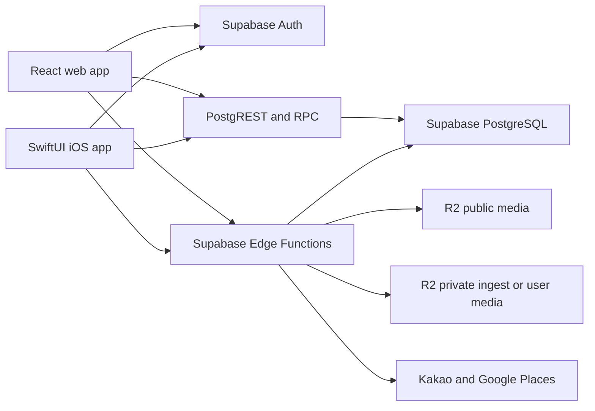
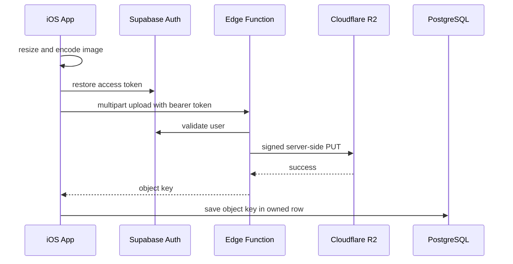

# Taste Buddy iOS Backend Integration Plan

이 문서는 SwiftUI 네이티브 앱이 기존 Taste Buddy backend를 안전하게 공유하기 위한 구현 계획이다.

대상은 Supabase Auth, PostgreSQL, Row Level Security, RPC, Edge Functions, Cloudflare R2, 외부 장소 API, 로컬 cache와 offline sync다. 화면 재구현 순서는 [`NATIVE_MIGRATION_GUIDE.md`](./NATIVE_MIGRATION_GUIDE.md), 기능 완료 여부는 [`PARITY_MATRIX.md`](./PARITY_MATRIX.md)에서 관리한다.

## 1. 목표

- 웹과 iOS가 동일한 Supabase project와 domain contract를 사용한다.
- Supabase PostgreSQL을 관계형 데이터와 권한의 source of truth로 유지한다.
- Cloudflare R2는 media object를 저장하고 DB에는 object key와 metadata만 저장한다.
- iOS 앱에는 publishable configuration만 포함하고 server secret은 포함하지 않는다.
- SwiftUI view는 Supabase SDK, SQL table 이름, R2 구현 세부사항을 직접 알지 않는다.
- anonymous user가 email account로 전환될 때 미각 기록과 피드백이 유지된다.
- calibration, profile interpretation, dining feedback, profile refinement가 기기 간 동기화된다.
- loading, retry, offline, conflict, partial failure를 정상 제품 상태로 다룬다.

## 2. 현재 Backend 구성



현재 저장소의 backend source:

- DB migration: [`../supabase/migrations`](../supabase/migrations)
- Edge Functions: [`../supabase/functions`](../supabase/functions)
- seed data: [`../supabase/seeds`](../supabase/seeds)
- web auth·profile·upload client: [`../src/lib/supabase.ts`](../src/lib/supabase.ts)
- taste·measurement·feedback client: [`../src/lib/tasteBuddySupabase.ts`](../src/lib/tasteBuddySupabase.ts)
- social graph client: [`../src/lib/tasteBuddyAgentSupabase.ts`](../src/lib/tasteBuddyAgentSupabase.ts)
- bookmark client: [`../src/lib/restaurantBookmarksSupabase.ts`](../src/lib/restaurantBookmarksSupabase.ts)
- notification client: [`../src/lib/notificationsSupabase.ts`](../src/lib/notificationsSupabase.ts)
- media URL resolver: [`../src/lib/mediaAssets.ts`](../src/lib/mediaAssets.ts)
- R2 operation guide: [`../docs/operations/cloudflare-r2-media-storage.md`](../docs/operations/cloudflare-r2-media-storage.md)
- place API guide: [`../docs/operations/place-index-api-sync.md`](../docs/operations/place-index-api-sync.md)

## 3. 데이터 영역

### 3.1 Identity And Social

| Table or RPC | 역할 | 현재 권한 |
| --- | --- | --- |
| `profiles` | Auth user와 연결된 표시 이름, nickname, avatar | 본인 read·insert·update |
| `profile_friendships` | 단방향 follow 관계 | 관련 사용자 read, requester insert, 관련 사용자 delete |
| `search_profiles_by_identity` | 이름·nickname 검색 | authenticated RPC, 내부에서 `auth.uid()` 확인 |
| `add_friend_by_nickname` | follow 생성과 알림 생성 | authenticated RPC |
| `get_friend_summary` | follower·following 수 | authenticated RPC |
| `get_profile_connections` | 연결 profile과 public activity summary | authenticated RPC |
| `taste_social_profiles` | 공개·followers·private taste identity | visibility 기반 RLS |
| `taste_dining_reviews` | social dining review | visible review read, owner write |

iOS domain:

- `UserProfile`
- `PublicTasteProfile`
- `ProfileConnection`
- `ConnectionSummary`
- `DiningReview`

### 3.2 Taste Measurement And Learning

| Table | 역할 |
| --- | --- |
| `measurement_sessions` | quick calibration 또는 측정 session |
| `measurement_results` | six-axis 결과 |
| `user_learned_deltas` | 반복 feedback에서 학습된 taste·perceptual delta |
| `tba_feedback_evidence_events` | feedback 변경이 학습 근거에 미친 event |
| `user_tba_confidence_states` | signal별 confidence와 evidence count |

모든 사용자 소유 row는 `auth.uid()` 기반 RLS를 유지한다. Swift DTO는 DB의 snake case를 직접 노출하지 않고 mapping layer에서 domain model로 변환한다.

### 3.3 Dining Experience And Feedback

| Table | 역할 |
| --- | --- |
| `reservations` | 현재 schema에서 dining experience의 상위 container |
| `reservation_dishes` | 경험에 포함된 dish |
| `feedback_submissions` | 식사 전체 feedback |
| `feedback_items` | dish별 평가·tag·회고·TBA snapshot |
| `feedback_parses` | feedback 해석 결과 |

첫 native scope에 예약 생성 UX는 없지만 현재 feedback schema는 reservation graph를 필요로 한다.

초기 호환 전략:

- iOS domain에서는 `DiningExperience`와 `DiningExperienceDish`로 표현한다.
- backend adapter는 기존 `reservations`와 `reservation_dishes`를 사용한다.
- 예약 UI 없이 기록을 시작하는 경우 `status = completed`인 내부 experience row를 생성한다.
- `external_ref`와 booking-specific field를 사용자에게 노출하지 않는다.

장기 전략:

- 실제 예약과 수동 dining 기록의 요구가 달라지면 `dining_experiences`를 별도 도입한다.
- schema를 분리하기 전에는 임시 row를 화면 계층에 노출하지 않는다.

### 3.4 Restaurant Content

| Table | 역할 |
| --- | --- |
| `restaurants` | restaurant identity와 소개 |
| `chefs` | chef profile |
| `source_documents` | 메뉴·인터뷰·기사 등 근거 |
| `dish_entities` | 정규화된 dish |
| `dish_observed_facts` | 관찰된 근거 |
| `dish_inference_profiles` | taste·perceptual vector와 interpretation 근거 |
| `research_rules` | inference rule |
| `media_assets` | 검수된 R2 asset metadata |

이 데이터는 content pipeline과 운영 도구만 수정해야 한다. 소비자 iOS 앱은 read-only다.

### 3.5 Place Index

| Table or function | 역할 |
| --- | --- |
| `restaurant_place_index` | provider place ID와 fallback 장소 정보 |
| `restaurant_operating_hours` | provider별 영업시간 |
| `kakao-place-lookup` | 실시간 Kakao 장소 검색 |
| `google-place-enrich` | 영업시간·웹사이트·평점 등 보강 |

Taste Buddy 고유 메뉴와 interpretation은 내부 DB를 기준으로 하고, 주소·전화·영업시간은 외부 provider의 최신 결과를 우선한다.

### 3.6 Bookmark And Notification

| Table | 역할 | 현재 제약 |
| --- | --- | --- |
| `restaurant_bookmark_lists` | 사용자 저장 목록 | lowercase `owner_email` 소유 |
| `restaurant_bookmarks` | 저장된 restaurant | lowercase `owner_email` 소유 |
| `notifications` | 사용자 알림 | `user_id` 소유 |

bookmark의 email ownership은 anonymous user, email 변경, account merge에 취약하다. iOS production integration 전에 `owner_id uuid references profiles(id)`로 전환하는 migration을 우선한다.

## 4. Auth And Session Plan

### 4.1 Auth 상태

```swift
enum SessionState {
    case restoring
    case anonymous(UserSession)
    case authenticated(UserSession)
    case signedOut
    case failed(SessionError)
}
```

### 4.2 진입 흐름

1. 앱 시작 시 Keychain에 보관된 Supabase session 복원을 시도한다.
2. session이 없고 anonymous auth가 허용되면 anonymous user를 생성한다.
3. Auth trigger가 같은 UUID의 `profiles` row를 만든다.
4. onboarding과 calibration은 anonymous UUID에 저장한다.
5. 사용자가 email OTP를 인증하면 기존 anonymous account에 email을 연결한다.
6. user UUID를 유지해 measurement와 feedback ownership을 보존한다.

새 email account로 별도 로그인해 anonymous UUID가 바뀌는 흐름은 자동 merge로 간주하지 않는다. merge 정책과 서버 작업이 없으면 데이터가 분리될 수 있으므로 UI에서 기존 profile 연결 intent를 명확히 구분한다.

### 4.3 iOS 인증 구현

- Supabase Swift client의 Auth session persistence를 사용한다.
- 추가 token이나 민감한 session value는 Keychain에 저장한다.
- email OTP deep link를 위한 custom URL scheme 또는 universal link를 구성한다.
- app lifecycle에서 auth state 변경을 구독한다.
- logout은 local session을 제거하되 server data를 삭제하지 않는다.
- account deletion은 Edge Function을 통해서만 수행한다.

### 4.4 Account Deletion 선결 조건

현재 `delete-account`는 Auth user를 삭제해 DB cascade는 수행하지만 R2 object는 자동 삭제하지 않는다.

production 전에 다음 순서로 확장한다.

1. 사용자 소유 avatar object를 조회한다.
2. feedback reflection object key를 조회한다.
3. R2 object를 삭제하거나 cleanup queue에 기록한다.
4. DB audit 또는 deletion job 결과를 기록한다.
5. 마지막에 Auth user를 삭제한다.
6. 일부 R2 삭제가 실패하면 재시도 가능한 tombstone을 남긴다.

## 5. iOS Configuration

### 5.1 앱에 포함 가능한 값

- Supabase project URL
- Supabase publishable key
- public media base URL
- environment 이름
- analytics public ID

Supabase publishable key는 공개 client identifier다. 데이터 보호는 key 은닉이 아니라 RLS와 server-side validation으로 수행한다.

### 5.2 앱에 포함하면 안 되는 값

- `SUPABASE_SECRET_KEY`
- `SUPABASE_SERVICE_ROLE_KEY`
- `R2_ACCESS_KEY_ID`
- `R2_SECRET_ACCESS_KEY`
- `KAKAO_REST_API_KEY`
- `GOOGLE_MAPS_API_KEY`
- private ingest bucket credential

### 5.3 권장 파일 구조

```text
ios/Config/
  Base.xcconfig
  Debug.xcconfig
  Release.xcconfig
  Secrets.local.xcconfig
```

- `Base.xcconfig`: key 이름과 비밀이 아닌 기본값
- `Debug.xcconfig`: staging project와 media origin
- `Release.xcconfig`: production project와 media origin
- `Secrets.local.xcconfig`: 로컬 override, git ignore

`project.yml`이 xcconfig를 참조하고 Info.plist에는 build setting placeholder만 둔다. Swift에서는 `BackendConfiguration`이 값을 읽고 누락 시 명확하게 실패한다.

staging과 production Supabase project를 분리한다. 개발 빌드가 production DB에 기록되지 않게 한다.

## 6. Swift Backend Layer

```text
TasteBuddy/
  Data/
    Backend/
      BackendConfiguration.swift
      SupabaseClientProvider.swift
      SessionController.swift
    DTO/
      ProfileDTO.swift
      MeasurementDTO.swift
      DiningFeedbackDTO.swift
      RestaurantDTO.swift
      SocialDTO.swift
    Repositories/
      SupabaseProfileRepository.swift
      SupabaseMeasurementRepository.swift
      SupabaseDiningFeedbackRepository.swift
      SupabaseRestaurantRepository.swift
      SupabaseBookmarkRepository.swift
      SupabaseSocialRepository.swift
      SupabaseNotificationRepository.swift
    Media/
      MediaURLResolver.swift
      MediaUploadClient.swift
      ImagePreparationService.swift
    Sync/
      MutationQueue.swift
      SyncCoordinator.swift
      CacheStore.swift
```

의존 방향:

```text
SwiftUI View
  -> Feature Store
  -> Domain Use Case
  -> Repository Protocol
  -> Supabase Repository or Fixture Repository
  -> Supabase Auth, PostgREST, RPC, Edge Function
```

### 6.1 Repository Map

| Repository | Supabase source |
| --- | --- |
| `SessionRepository` | Auth anonymous, OTP, session restore, sign out |
| `ProfileRepository` | `profiles`, identity RPC |
| `SocialRepository` | friendships, connection RPC, social profiles and reviews |
| `MeasurementRepository` | measurement sessions and results |
| `LearningRepository` | learned deltas, evidence events, confidence states |
| `DiningFeedbackRepository` | reservation graph, submissions, items, parses |
| `RestaurantRepository` | restaurant, chef, dish, inference, place index |
| `BookmarkRepository` | bookmark lists and bookmarks |
| `NotificationRepository` | notifications read and read state |
| `MediaRepository` | upload Edge Functions, media URL resolution |

### 6.2 DTO 규칙

- UUID는 Swift `UUID`로 decode한다.
- `timestamptz`는 하나의 ISO 8601 decoder 전략으로 통일한다.
- PostgreSQL `numeric`은 정밀도가 필요한 값과 UI score를 구분한다.
- JSONB는 가능한 경우 typed `Codable` struct로 만든다.
- 아직 schema가 유동적인 payload만 제한적으로 JSON value wrapper를 사용한다.
- DB enum raw value와 Swift enum의 unknown fallback 전략을 둔다.
- nullable과 missing field를 구분해야 하는 mutation DTO를 별도로 둔다.

## 7. Database And RLS Hardening

현재 schema를 그대로 연결하기 전에 아래 migration을 준비한다.

### 7.1 Content Write 권한 제한

현재 초기 migration의 일부 policy는 authenticated user에게 `restaurants`, `chefs`, place index insert·update를 허용한다.

production 기준:

- 소비자 app은 public content read-only
- content write는 service role, operator role 또는 별도 admin backend만 허용
- `restaurant_place_index`와 `restaurant_operating_hours` write도 sync script와 server function으로 제한

### 7.2 Bookmark Ownership 변경

```text
owner_email text
  -> owner_id uuid references profiles(id)
```

전환 순서:

1. `owner_id` nullable column 추가
2. auth email을 기준으로 기존 row backfill
3. iOS와 web을 dual-read 또는 dual-write로 전환
4. RLS를 `owner_id = auth.uid()`로 변경
5. 누락 row를 확인
6. `owner_id` not null 적용
7. email ownership 제거

### 7.3 Atomic Feedback Mutation

현재 dining feedback 저장은 여러 table과 image upload를 순차 처리하므로 중간 실패 시 partial state가 남을 수 있다.

다음 중 하나를 구현한다.

- PostgreSQL RPC가 submission, items, parse, evidence, confidence update를 transaction으로 처리
- Edge Function이 server-side transaction RPC를 호출

모든 mutation은 `client_mutation_id`를 받아 재시도 시 중복 row를 만들지 않아야 한다.

### 7.4 Notification Write

- iOS client는 일반 `system` notification을 직접 insert하지 않는다.
- follower, dish like, comment 알림은 DB trigger 또는 server function에서 생성한다.
- client는 read와 read-state update만 수행한다.

### 7.5 RPC Audit

- `security definer` 함수는 `search_path`를 고정한다.
- 함수 내부에서 `auth.uid()`와 대상 row ownership을 검사한다.
- 필요한 role에만 execute 권한을 grant한다.
- profile search와 외부 place lookup에 rate limit을 둔다.
- 반환 field는 public profile policy에 맞게 최소화한다.

## 8. R2 Media Plan

### 8.1 Bucket 분리

```text
taste-buddy-public-media
  user-avatars/{user-id}/{asset-id}.jpg
  chefs/{chef-slug}.png
  restaurants/{restaurant-slug}/hero.webp
  menus/{restaurant-slug}/{source-slug}.webp

taste-buddy-private-user-media
  feedback-reflections/{user-id}/{yyyy-mm-dd}/{asset-id}.jpg

taste-buddy-private-ingest
  raw/catchtable/{restaurant-slug}/...
  raw/ocr/{restaurant-slug}/...
```

현재 reflection photo는 public bucket에 저장된다. 제품 문서에서 private learning artifact로 정의했으므로 production 전 private bucket으로 이동하는 것을 기본안으로 한다.

### 8.2 Public Media

- DB에는 full URL 대신 immutable object key를 저장한다.
- iOS `MediaURLResolver`가 public base URL과 key를 조합한다.
- avatar를 교체할 때 같은 key를 덮어쓰지 않고 새 UUID key를 생성한다.
- immutable cache header를 유지한다.
- `media_assets.review_status = approved`인 content asset만 노출한다.

### 8.3 Private Reflection Photo

권장 조회 흐름:

1. iOS가 feedback DTO에서 private object key를 받는다.
2. 인증된 media endpoint에 짧은 만료 시간의 signed URL을 요청한다.
3. endpoint는 `auth.uid()`가 해당 feedback owner인지 확인한다.
4. iOS image loader가 signed URL을 memory·disk cache에 제한적으로 저장한다.
5. logout과 account switch 시 private image cache를 제거한다.

### 8.4 Upload 흐름



현재 제한:

- avatar: 최대 2MB, WebP·PNG·JPEG
- reflection photo: 최대 6MB, WebP·PNG·JPEG
- reflection 권장 최대 변: 1600px

iOS image preparation:

- orientation을 normalize한다.
- avatar는 최대 512px로 줄인다.
- reflection은 최대 1600px로 줄인다.
- JPEG 또는 지원되는 WebP로 encode한다.
- EXIF location 등 불필요한 metadata를 제거한다.
- upload 전에 byte limit을 검사한다.

### 8.5 Media 수명주기

- DB mutation이 실패하면 업로드된 object를 orphan queue에 기록한다.
- feedback 삭제 시 연결 private object도 삭제한다.
- avatar 교체 시 이전 object는 즉시 삭제하거나 grace period 후 정리한다.
- account 삭제 시 모든 사용자 object를 정리한다.
- 정기 orphan sweeper가 DB reference가 없는 object를 탐지한다.
- R2 secret은 Edge Function secret으로만 관리한다.

## 9. External Place API Plan

iOS는 Kakao와 Google key를 직접 갖지 않는다.

조회 순서:

1. `restaurant_place_index`에서 provider ID와 fallback 정보를 읽는다.
2. `kakao-place-lookup`으로 최신 주소·전화·좌표·Kakao map URL을 조회한다.
3. 필요한 상세 화면에서만 `google-place-enrich`를 호출한다.
4. 실시간 호출 실패 시 DB fallback을 사용한다.
5. 검색 결과는 짧은 TTL cache를 사용한다.

비용과 abuse 방지:

- query length와 radius 제한을 유지한다.
- authenticated request와 per-user rate limit을 적용한다.
- Google enrichment는 모든 검색 결과가 아니라 detail 진입 시 선택적으로 호출한다.
- provider error와 fallback 사용 여부를 관측한다.

## 10. Cache, Offline, And Sync

### 10.1 Source Of Truth

| 데이터 | Source of truth | Local 역할 |
| --- | --- | --- |
| session | Supabase Auth | Keychain session restore |
| profile·measurement·feedback | Supabase DB | last-known cache와 pending mutation |
| public restaurant content | Supabase DB | read cache |
| public media | R2 | URL cache |
| private reflection media | private R2 | authenticated short-lived cache |
| recent searches·UI preference | device | UserDefaults |
| preview data | fixture files | development only |

### 10.2 Offline Mutation Queue

offline 지원 우선순위:

1. calibration result
2. dining feedback draft와 submission
3. bookmark mutation
4. notification read state

각 queue item:

```swift
struct PendingMutation {
    let id: UUID
    let userID: UUID
    let kind: MutationKind
    let payload: Data
    let createdAt: Date
    let attemptCount: Int
}
```

규칙:

- account가 바뀌면 다른 user의 queue를 전송하지 않는다.
- mutation마다 stable `client_mutation_id`를 사용한다.
- retry는 exponential backoff와 최대 횟수를 둔다.
- validation·permission error는 자동 재시도하지 않는다.
- upload와 DB write가 분리되면 compensation action을 기록한다.

### 10.3 Conflict 정책

- profile identity: server `updated_at`과 명시적 사용자 저장을 기준으로 last accepted write
- bookmark: item 단위 upsert·delete, 전체 목록 delete-and-reinsert 금지
- notification read: 가장 이른 non-null `read_at` 유지
- measurement: immutable append
- submitted feedback: version 또는 `updated_at` 기반 optimistic concurrency
- content catalog: server authoritative

현재 web bookmark 구현의 전체 delete 후 재insert 방식은 iOS에 이식하지 않는다. item mutation API로 교체한다.

## 11. Error Model

공통 error:

```swift
enum BackendError: Error {
    case configuration
    case unauthenticated
    case forbidden
    case validation(message: String)
    case conflict
    case rateLimited
    case offline
    case transport
    case decoding
    case server(message: String)
}
```

사용자 메시지는 backend 원문을 그대로 노출하지 않는다. 화면은 최소한 다음을 구분한다.

- 로그인 필요
- 연결 없음
- 일시적 서버 오류
- 입력 수정 필요
- 권한 없음
- 저장 충돌
- 업로드 용량·형식 오류

## 12. Backend 구현 단계

### Backend Phase 0. Staging And Baseline

현재 저장소 기준선과 staging 안전 gate는 [`Reference/BACKEND_BASELINE.md`](./Reference/BACKEND_BASELINE.md)에 기록한다. 연결된 project의 환경 분류가 확인되기 전에는 remote migration, deploy, seed를 실행하지 않는다.

작업:

- staging Supabase project를 준비한다.
- migration 적용 순서와 현재 remote schema를 비교한다.
- RLS policy와 RPC 목록을 export한다.
- staging R2 public·private bucket과 custom domain을 준비한다.
- seed와 test account를 고정한다.

완료 조건:

- 개발 빌드가 production data를 사용하지 않는다.
- fresh DB에서 migration을 순서대로 적용할 수 있다.

### Backend Phase 1. Configuration And Auth

작업:

- Supabase Swift package를 project dependency로 고정한다.
- xcconfig와 `BackendConfiguration`을 추가한다.
- session restore, anonymous auth, email OTP, link-current-profile, logout을 구현한다.
- deep link를 구성한다.
- auth repository test를 작성한다.

완료 조건:

- anonymous UUID를 유지한 채 email account로 전환된다.
- 앱 재실행 후 session이 복원된다.
- secret이 app bundle과 git에 없다.

현재 상태:

- Supabase Swift package가 Xcode project dependency로 추가됐고 Debug/Release `xcconfig`가 app target에 연결됐다.
- Info.plist는 `TB_BACKEND_ENVIRONMENT`, `TB_SUPABASE_URL`, `TB_SUPABASE_PUBLISHABLE_KEY`, `TB_PUBLIC_MEDIA_BASE_URL` build setting placeholder만 가진다.
- `BackendConfiguration`은 placeholder와 service-role/secret marker를 거부하며, `SupabaseClientProvider`와 `BackendSessionRepository`가 session restore foundation을 제공한다.
- `AppModel`은 injected session repository로 앱 시작 시 restore를 한 번 수행한다.
- `BackendAuthRepository`가 anonymous session 생성, email OTP 발송/검증, current profile email linking, local sign out, `delete-account` Edge Function 호출 contract를 Swift로 감싼다.
- `BackendIntegrationTests`가 config decode, secret guard, injected restore, Auth intent/message mapping, fixture auth result를 검증한다.
- local `Secrets.local.xcconfig`에 staging 값이 없는 상태에서는 앱 bundle에 placeholder만 들어가므로 live network auth는 수행하지 않는다.
- 실제 staging anonymous auth 생성, email OTP roundtrip, logout, deletion, deep link, live staging account verification은 남아 있다.

### Backend Phase 2. Read-Only Content

작업:

- restaurant, chef, dish, inference, media DTO를 만든다.
- public content repository를 구현한다.
- R2 public media resolver와 image cache를 구현한다.
- fixture와 Supabase 결과의 domain mapping test를 작성한다.

완료 조건:

- Home·Search·Restaurant detail이 같은 repository contract를 사용한다.
- public content는 anonymous session에서도 읽힌다.

### Backend Phase 3. Profile And Social

작업:

- profile hydration·update
- identity search RPC
- follow·unfollow
- summary와 connection list
- social profiles와 reviews
- notification read

완료 조건:

- web과 iOS에서 같은 account profile과 관계가 보인다.
- 다른 사용자의 private data를 직접 query할 수 없다.

### Backend Phase 4. Measurement And Learning

작업:

- measurement session과 six-axis result transaction
- latest·recent snapshot query
- learned delta와 confidence state read
- calibration offline queue
- golden contract test

완료 조건:

- 같은 account의 measurement가 web·iOS에서 일치한다.
- 중복 retry가 measurement를 두 번 만들지 않는다.

### Backend Phase 5. Dining Feedback

작업:

- internal dining experience adapter
- atomic feedback mutation RPC
- feedback edit·delete
- TBA snapshot·evidence·confidence update
- reflection photo upload와 compensation

완료 조건:

- 예약 UI 없이 dining feedback을 저장할 수 있다.
- 실패한 multi-step mutation이 partial feedback을 남기지 않는다.
- reflection media ownership 검사가 통과한다.

### Backend Phase 6. Bookmark And Notification

작업:

- bookmark ownership을 UUID로 migration
- list와 item 단위 mutation
- local bookmark migration
- trigger·server-generated notification
- unread count와 read state

완료 조건:

- email 변경 후에도 bookmark ownership이 유지된다.
- 두 기기 mutation이 전체 목록을 덮어쓰지 않는다.

### Backend Phase 7. R2 Privacy And Lifecycle

작업:

- reflection photo private bucket
- signed read endpoint
- delete endpoint
- account deletion cleanup
- orphan object sweeper
- cache purge 정책

완료 조건:

- 다른 user token과 URL만으로 private reflection을 읽을 수 없다.
- account 삭제 후 사용자 media가 남지 않거나 cleanup queue에서 추적된다.

### Backend Phase 8. Place APIs

작업:

- Kakao·Google Edge Function DTO
- auth·rate limit
- TTL cache
- DB fallback
- provider cost와 failure telemetry

완료 조건:

- 외부 API key가 app에 없다.
- provider 장애 시 restaurant detail이 DB fallback으로 열린다.

### Backend Phase 9. Offline And Conflict

작업:

- persistent mutation queue
- retry와 cancellation
- user isolation
- conflict policy
- sync status UI contract

완료 조건:

- offline에서 작성한 calibration과 feedback이 재연결 후 한 번만 반영된다.
- account 전환 시 queue와 cache가 섞이지 않는다.

### Backend Phase 10. Security And Release

작업:

- RLS negative test
- Edge Function authorization test
- rate limit
- secret scan
- backup·restore drill
- migration rollback 또는 forward-fix 절차
- log redaction
- production monitoring과 alert

완료 조건:

- anon, user A, user B, operator role의 허용·거부 matrix가 자동 테스트된다.
- schema와 function deploy가 CI에서 재현 가능하다.
- production incident 시 user, mutation ID, function request ID로 추적할 수 있다.

## 13. 필요한 Backend 변경 목록

우선순위 순서:

1. reflection photo를 private media로 전환
2. account deletion에 R2 cleanup 추가
3. content·place write RLS를 operator 또는 service role로 제한
4. bookmark ownership을 email에서 user UUID로 변경
5. dining feedback을 transaction RPC와 idempotency key로 변경
6. notification 생성을 trigger·server function으로 제한
7. profile search·place function rate limit
8. user-owned media metadata와 orphan cleanup 기록
9. staging·production 환경 분리
10. RLS·RPC·Edge Function contract test 자동화

## 14. 검증 Matrix

| 주체 | 확인 |
| --- | --- |
| anon user | public restaurant content read, own anonymous measurement write |
| authenticated user A | own profile·measurement·feedback·bookmark read/write |
| authenticated user B | user A private row read/write 거부 |
| follower | followers visibility profile read 허용, private visibility 거부 |
| operator | content pipeline write 허용 |
| public request | private media와 secret-backed function abuse 거부 |
| deleted account | DB cascade와 R2 cleanup 확인 |
| offline client | 재연결 후 idempotent sync |

필수 test:

- DTO decoding fixture
- repository integration
- RLS positive·negative SQL test
- RPC ownership test
- Edge Function auth·size·type validation
- upload 후 DB 실패 compensation
- account deletion cleanup
- migration from empty DB
- migration from current production-like fixture

## 15. 운영과 관측성

기록할 event:

- auth restore·anonymous create·email link result
- repository request latency와 error category
- RLS denial count
- Edge Function status와 duration
- R2 upload bytes·failure·orphan cleanup
- place provider latency·cost category·fallback
- offline queue depth·retry·dead letter
- schema version과 app version

기록하지 않을 값:

- access token
- service role key
- R2 credential
- email OTP
- reflection note 원문
- private image URL
- 전체 external provider response의 불필요한 PII

## 16. 완료 정의

Backend integration은 단순히 iOS에서 Supabase row를 읽는 것으로 완료되지 않는다.

다음이 모두 충족돼야 한다.

- Auth session과 anonymous-to-email 전환이 안정적이다.
- 모든 user-owned table에 RLS negative test가 있다.
- web과 iOS가 같은 domain contract를 사용한다.
- public content, user data, private media의 권한이 구분된다.
- R2 upload, read, replace, delete, account cleanup 수명주기가 닫혀 있다.
- feedback mutation이 atomic하고 idempotent하다.
- offline retry가 중복 데이터를 만들지 않는다.
- external API key와 backend secret이 app bundle에 없다.
- staging에서 migration, function deploy, integration test를 재현할 수 있다.
- [`PARITY_MATRIX.md`](./PARITY_MATRIX.md)의 backend 항목이 모두 complete다.
